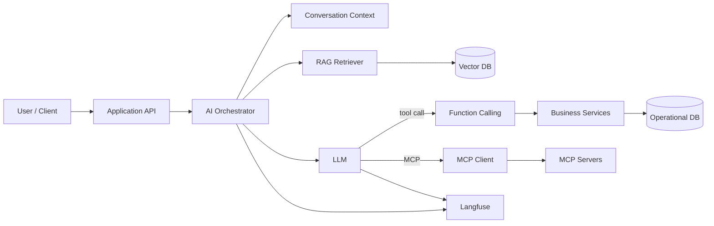
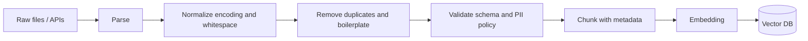
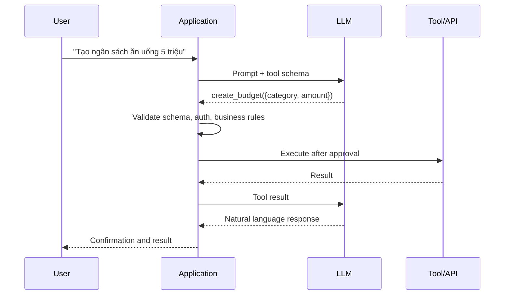

# TÀI LIỆU TỔNG HỢP: AI INTEGRATION

Tài liệu này hệ thống hóa cách tích hợp AI vào ứng dụng hiện đại, tập trung vào LLM, ChatOpt, chuẩn hóa dữ liệu, Function Calling, Vector Database, RAG, LangChain, Langfuse và MCP. Mục tiêu là giúp thiết kế một hệ thống AI có thể kiểm soát, quan sát, bảo mật và mở rộng được trong môi trường production.

> **Phạm vi:** Nội dung dùng được cho chatbot, trợ lý nghiệp vụ, hệ thống hỏi đáp tài liệu và các ứng dụng có hành động thông qua API. Các ví dụ Python mang tính minh họa; tên model, SDK và nhà cung cấp có thể thay đổi theo thời điểm triển khai.

---

## 1. Bức tranh tổng thể

### 1.1. AI Integration là gì?

**AI Integration** là việc đưa mô hình AI vào luồng nghiệp vụ của sản phẩm thay vì chỉ gọi một API chat đơn lẻ. Một tích hợp hoàn chỉnh thường có các lớp:

1. **Ứng dụng:** UI, API, authentication, rate limit.
2. **AI Orchestrator:** quản lý prompt, context, routing, retry và workflow.
3. **LLM:** sinh câu trả lời, lập luận, trích xuất dữ liệu hoặc chọn tool.
4. **Knowledge Layer:** dữ liệu nghiệp vụ, embeddings, Vector DB và RAG.
5. **Tool Layer:** Function Calling, API nội bộ và MCP server.
6. **Observability:** trace, token usage, latency, cost, feedback và evaluation.
7. **Governance:** phân quyền, bảo vệ dữ liệu, audit log và human approval.

### 1.2. Kiến trúc tham khảo



**Nguyên tắc quan trọng:** LLM không nên truy cập trực tiếp database production. LLM chỉ đề xuất câu trả lời hoặc tool call; lớp ứng dụng phải kiểm tra schema, quyền, nghiệp vụ và kết quả trước khi thực thi.

---

## 2. LLM (Large Language Model)

### 2.1. LLM làm được gì?

LLM là mô hình dự đoán chuỗi token tiếp theo dựa trên ngữ cảnh. Trong ứng dụng, LLM thường được dùng cho:

* Chat và hỏi đáp tự nhiên.
* Tóm tắt, phân loại, dịch và trích xuất dữ liệu.
* Sinh JSON theo schema.
* Chọn công cụ hoặc điều phối workflow.
* Viết và biến đổi nội dung.

LLM **không phải** database sự thật. Kiến thức có thể lỗi thời, câu trả lời có thể bịa đặt (hallucination), và mô hình không tự biết dữ liệu nội bộ của doanh nghiệp nếu không được cung cấp context.

### 2.2. Các tham số cần hiểu

| Tham số | Ý nghĩa | Lưu ý |
|---|---|---|
| `temperature` | Mức ngẫu nhiên khi sinh nội dung | Thấp cho trích xuất, cao hơn cho brainstorming |
| `max_tokens` | Giới hạn độ dài output | Cần chừa budget cho prompt và context |
| `top_p` | Giới hạn tập xác suất được chọn | Thường chỉ chỉnh một trong `temperature` và `top_p` |
| `model` | Model dùng để xử lý | Chọn theo chất lượng, latency, chi phí và privacy |
| `seed` | Cố gắng tái lập kết quả nếu provider hỗ trợ | Không đảm bảo deterministic tuyệt đối |

### 2.3. Prompt theo vai trò

Một prompt tốt nên tách rõ:

* **System:** vai trò, quy tắc, giới hạn và tiêu chí an toàn.
* **Developer:** format, policy và logic ứng dụng.
* **User:** yêu cầu hiện tại.
* **Context:** dữ liệu truy xuất được, có nguồn.
* **Output schema:** cấu trúc kết quả máy có thể parse.

```text
Bạn là trợ lý tài chính cá nhân.
Chỉ sử dụng thông tin trong CONTEXT khi trả lời về dữ liệu tài khoản.
Nếu thiếu dữ liệu, nói rõ là chưa đủ thông tin; không tự đoán.
Không tự thực hiện giao dịch. Với thao tác thay đổi dữ liệu, hãy đề xuất tool call.
Trả lời bằng tiếng Việt, ngắn gọn và nêu nguồn tài liệu nếu có.
```

### 2.4. Streaming và quản lý hội thoại

* Streaming giúp người dùng thấy kết quả sớm nhưng không làm giảm tổng token.
* Không gửi toàn bộ lịch sử vô hạn vào mỗi request; cần giới hạn, tóm tắt hoặc lưu các message quan trọng.
* Context window là giới hạn kỹ thuật, không phải lý do để nhồi càng nhiều dữ liệu càng tốt.
* Lưu conversation và message với `conversation_id`, `user_id`, timestamp, model và token usage để audit.

---

## 3. ChatOpt: tối ưu hóa trải nghiệm và vận hành chatbot

Trong tài liệu này, **ChatOpt** được hiểu là lớp tối ưu hóa chatbot, bao gồm prompt optimization, context optimization, model routing và tối ưu chi phí. Nếu dự án dùng “ChatOpt” với nghĩa là một framework cụ thể, cần thay thế lớp này bằng adapter tương ứng; các nguyên tắc bên dưới vẫn giữ nguyên.

### 3.1. Các chiến lược ChatOpt

1. **Prompt optimization:** prompt rõ ràng, có ví dụ (few-shot) và output schema.
2. **Context optimization:** chỉ đưa context liên quan, loại bỏ trùng lặp, giới hạn số chunk.
3. **Model routing:** câu hỏi đơn giản dùng model nhanh/rẻ; tác vụ khó dùng model mạnh hơn.
4. **Semantic caching:** cache câu hỏi tương đương khi dữ liệu cho phép; không cache dữ liệu nhạy cảm tùy tiện.
5. **Conversation compaction:** tóm tắt lịch sử cũ và giữ lại các quyết định, ID, constraint quan trọng.
6. **Fallback:** retry có backoff, đổi provider/model khi timeout hoặc lỗi tạm thời.
7. **Guardrails:** từ chối yêu cầu ngoài phạm vi và yêu cầu xác nhận trước hành động rủi ro.

### 3.2. Chỉ số nên theo dõi

* **Quality:** correctness, groundedness, task success, tỷ lệ escalation.
* **Performance:** time to first token, total latency, throughput, error rate.
* **Cost:** input/output tokens, chi phí mỗi conversation, cache hit rate.
* **Safety:** prompt injection, PII leakage, tool call bị từ chối, hành động cần approval.

Tối ưu không nên chỉ dựa vào giảm token. Một câu trả lời rẻ nhưng sai có thể tạo chi phí nghiệp vụ lớn hơn nhiều.

---

## 4. Chuẩn hóa dữ liệu

### 4.1. Vì sao cần chuẩn hóa?

Dữ liệu không đồng nhất làm giảm chất lượng embedding, retrieval và function calling. Trước khi đưa dữ liệu vào AI, cần chuẩn hóa cả **nội dung**, **metadata** và **schema**.

### 4.2. Pipeline chuẩn hóa



### 4.3. Checklist

* Chuẩn hóa encoding UTF-8, timezone, ngày tháng, số tiền và đơn vị đo.
* Loại bỏ header/footer lặp lại, HTML thừa, khoảng trắng và nội dung trùng.
* Giữ heading, tiêu đề, phiên bản, quyền truy cập và nguồn gốc tài liệu.
* Gắn metadata ổn định: `document_id`, `source`, `title`, `section`, `updated_at`, `tenant_id`, `access_tags`.
* Phân loại PII/secrets; masking hoặc loại bỏ dữ liệu không cần cho use case.
* Version hóa tài liệu và embedding model để có thể re-index.
* Validate bằng schema trước khi index; bản ghi lỗi phải đi vào dead-letter queue.

Ví dụ document chuẩn hóa:

```json
{
  "id": "policy-2026-001#section-03",
  "text": "Khoản hoàn tiền được xử lý trong 3 ngày làm việc...",
  "metadata": {
    "source": "refund-policy.pdf",
    "title": "Chính sách hoàn tiền",
    "section": "03",
    "language": "vi",
    "updated_at": "2026-08-01T00:00:00Z",
    "tenant_id": "public",
    "access_tags": ["customer"]
  }
}
```

---

## 5. Function Calling và Structured Output

### 5.1. Function Calling là gì?

**Function Calling** cho phép LLM trả về tên function và arguments theo schema thay vì tự gọi API. Ứng dụng nhận kết quả đó, kiểm tra rồi mới thực thi.



### 5.2. Ví dụ schema

```python
from pydantic import BaseModel, Field

class CreateBudgetArgs(BaseModel):
    category: str = Field(min_length=1, max_length=80)
    amount: int = Field(gt=0, le=1_000_000_000)
    month: str = Field(pattern=r"^\d{4}-\d{2}$")
```

Các bước bắt buộc:

1. Parse arguments bằng schema typed, không dùng `eval`.
2. Xác thực user/tenant và quyền gọi tool.
3. Kiểm tra nghiệp vụ ở server, không tin instruction từ LLM.
4. Phân loại tool: read-only, reversible write, irreversible write.
5. Yêu cầu user confirmation với giao dịch, xóa dữ liệu hoặc hành động bên ngoài.
6. Ghi audit log gồm actor, arguments đã mask, kết quả và request ID.
7. Áp dụng timeout, retry có giới hạn, idempotency key và rate limit.

### 5.3. Structured Output khác gì Function Calling?

* **Structured Output:** LLM trả về dữ liệu theo JSON schema để ứng dụng sử dụng.
* **Function Calling:** LLM yêu cầu ứng dụng thực thi một hành động/tool.

Cả hai cần validate ở backend. JSON hợp lệ về cú pháp chưa chắc hợp lệ về nghiệp vụ.

---

## 6. Vector Database

### 6.1. Khái niệm

Embedding biến text thành vector số biểu diễn ngữ nghĩa. Vector Database lưu vector cùng metadata để tìm các đoạn có độ tương đồng cao với query.

Các lựa chọn phổ biến gồm pgvector, Qdrant, Weaviate, Milvus, OpenSearch và dịch vụ vector managed. Chọn theo hạ tầng, filter metadata, quy mô, SLA, khả năng backup và chi phí vận hành.

### 6.2. Quy trình index và query

1. Chia tài liệu thành chunk có kích thước hợp lý, không cắt mất ngữ nghĩa.
2. Sinh embedding bằng model nhất quán với query.
3. Lưu vector, text, metadata và phiên bản embedding.
4. Khi query, embedding câu hỏi rồi tìm top-k gần nhất.
5. Lọc quyền truy cập bằng metadata trước hoặc trong truy vấn.
6. Có thể rerank kết quả bằng model reranker.

Độ tương đồng thường dùng cosine similarity:

$$
\operatorname{cosine}(a,b) = \frac{a \cdot b}{\|a\|\|b\|}
$$

Vector search không thay thế database giao dịch. Database nghiệp vụ vẫn là nguồn sự thật (source of truth); Vector DB là chỉ mục phục vụ tìm kiếm ngữ nghĩa.

### 6.3. Lỗi thường gặp

* Chunk quá dài làm retrieval kém chính xác; quá ngắn làm mất context.
* Không filter `tenant_id` hoặc quyền truy cập dẫn đến rò rỉ dữ liệu.
* Đổi embedding model nhưng không re-index.
* Chỉ dùng similarity score mà không đánh giá precision/recall.
* Index tài liệu cũ nhưng không có cơ chế delete/update theo `document_id`.

---

## 7. RAG (Retrieval-Augmented Generation)

### 7.1. RAG là gì?

RAG là mô hình kết hợp retrieval và generation: hệ thống tìm tài liệu liên quan trước, sau đó đưa các tài liệu này vào context của LLM để tạo câu trả lời grounded hơn.

```text
Question
  -> Query rewrite / classify
  -> Hybrid retrieval (keyword + vector)
  -> Metadata permission filter
  -> Rerank and deduplicate
  -> Context assembly with citations
  -> LLM generation
  -> Groundedness / policy check
  -> Answer
```

### 7.2. Khi nào dùng RAG và khi nào fine-tuning?

| Nhu cầu | RAG | Fine-tuning |
|---|---:|---:|
| Kiến thức thay đổi thường xuyên | Phù hợp | Không tối ưu |
| Hỏi đáp tài liệu nội bộ | Phù hợp | Có thể không cần |
| Muốn model biết format/phong cách ổn định | Hạn chế | Phù hợp hơn |
| Cần cập nhật dữ liệu ngay | Phù hợp | Không phù hợp |
| Dữ liệu cần trích dẫn nguồn | Phù hợp | Không đảm bảo |

RAG không tự động loại bỏ hallucination. Cần yêu cầu model chỉ dùng context, trả lời “không đủ dữ liệu” khi cần, và hiển thị nguồn để người dùng kiểm tra.

### 7.3. Đánh giá RAG

* **Retrieval:** context có chứa đáp án không, precision@k, recall@k, MRR.
* **Generation:** faithfulness, answer relevance, completeness.
* **Product:** task success, user feedback, tỷ lệ chuyển người thật.
* Tạo bộ câu hỏi chuẩn (golden set), chạy regression sau mỗi thay đổi prompt, chunking, model hoặc index.

---

## 8. LangChain

LangChain cung cấp các abstraction cho model, prompt, retriever, tool, agent, parser và runnable pipeline. Nên dùng nó ở lớp orchestration; không nên để framework che mất các policy quan trọng của ứng dụng.

### 8.1. Ví dụ RAG tối giản

```python
from langchain_core.prompts import ChatPromptTemplate
from langchain_openai import ChatOpenAI

prompt = ChatPromptTemplate.from_messages([
    ("system", "Chỉ trả lời dựa trên CONTEXT. Nếu không đủ dữ liệu, nói rõ."),
    ("human", "CONTEXT:\n{context}\n\nQUESTION:\n{question}"),
])

model = ChatOpenAI(model="your-model", temperature=0)

# retriever nên được tạo từ Vector DB với filter quyền truy cập ở backend.
def answer(question: str, retriever) -> str:
    documents = retriever.invoke(question)
    context = "\n\n".join(document.page_content for document in documents)
    return (prompt | model).invoke({
        "context": context,
        "question": question,
    }).content
```

### 8.2. Nguyên tắc dùng LangChain

* Dùng chain/runnable rõ ràng cho workflow ổn định; chỉ dùng agent khi cần chọn tool linh hoạt.
* Tách prompt, retriever, tool và policy thành module có test.
* Không đặt secrets trong prompt hoặc log.
* Pin version, theo dõi breaking changes và viết integration test với provider thật.
* Đặt timeout, retry, fallback và giới hạn số vòng lặp của agent.

---

## 9. Langfuse: tracing, monitoring và evaluation

Langfuse là lớp observability cho LLM application. Nó giúp quan sát một request từ API đến chain, retriever, model và tool, đồng thời ghi nhận token, latency, cost và feedback.

### 9.1. Nên trace những gì?

* `trace_id`, `session_id`, `user_id` đã được anonymize.
* Prompt version, model, temperature và provider.
* Input/output đã mask PII.
* Retrieval query, document IDs, score và metadata không nhạy cảm.
* Tool name, validation result, latency và lỗi.
* Token usage, estimated cost và user feedback.

### 9.2. Ví dụ tích hợp

```python
from langfuse import observe

@observe()
def answer_with_rag(question: str, retriever, chain):
    documents = retriever.invoke(question)
    context = "\n\n".join(doc.page_content for doc in documents)
    return chain.invoke({"question": question, "context": context})
```

Trong production, cần cấu hình sampling nếu traffic lớn, mask dữ liệu cá nhân trước khi gửi telemetry, đặt retention phù hợp và dùng prompt version để so sánh các lần triển khai.

### 9.3. Vòng lặp cải tiến

```text
Trace -> Dataset -> Evaluation -> Prompt/model change -> A/B or canary -> Trace
```

Không đánh giá AI chỉ bằng vài câu hỏi demo. Hãy lưu các case thật đã ẩn danh, case thất bại và các câu hỏi biên để làm regression dataset.

---

## 10. MCP (Model Context Protocol)

### 10.1. MCP là gì?

MCP là một giao thức chuẩn hóa cách AI client kết nối tới **tools**, **resources** và **prompts** do MCP server cung cấp. MCP giúp tái sử dụng tích hợp thay vì viết adapter riêng cho từng agent hoặc ứng dụng.

* **MCP Host:** ứng dụng chứa trải nghiệm AI.
* **MCP Client:** thành phần trong host kết nối tới server.
* **MCP Server:** expose tools/resources/prompts cho client.

### 10.2. MCP và Function Calling

Function Calling là cơ chế model yêu cầu gọi tool trong một API conversation. MCP là giao thức discovery và giao tiếp giữa AI client với tool server. Một MCP tool vẫn có thể được adapter thành function schema để model sử dụng.

### 10.3. Kiến trúc MCP an toàn

* Chỉ kết nối tới server tin cậy, pin version và kiểm tra manifest.
* Cấp quyền tối thiểu theo từng tool; tách read và write.
* Không truyền token người dùng vào server nếu không cần.
* Validate input/output ở cả client và server.
* Hiển thị rõ tool nào sẽ được gọi và yêu cầu approval cho hành động nguy hiểm.
* Timeout, audit log, network egress policy và kill switch phải nằm ngoài LLM.
* Xem nội dung từ resource như **untrusted input**; không để tài liệu điều khiển policy của system prompt.

### 10.4. Khi nào nên dùng MCP?

Dùng MCP khi có nhiều client AI cần dùng chung tool, cần discovery chuẩn hoặc muốn tách tool integration khỏi ứng dụng. Với một ứng dụng nhỏ chỉ có vài API nội bộ, adapter Function Calling trực tiếp thường đơn giản hơn.

---

## 11. Bảo mật và độ tin cậy

### 11.1. Prompt injection

Prompt injection là khi input hoặc tài liệu không tin cậy cố thay đổi instruction của hệ thống. Biện pháp:

* Phân vùng rõ system instruction, user input và retrieved context.
* Xem mọi tài liệu retrieved như dữ liệu, không phải mệnh lệnh.
* Không để LLM tự quyết định quyền truy cập.
* Validate output và tool arguments ở code.
* Dùng allowlist tool, approval và sandbox.

### 11.2. Các rủi ro cần kiểm soát

| Rủi ro | Kiểm soát |
|---|---|
| Rò rỉ PII/secret | Masking, DLP, access filter, retention |
| Tool gọi sai | Schema, authorization, confirmation, idempotency |
| Hallucination | RAG, citation, groundedness check, fallback |
| Chi phí tăng đột biến | Token budget, rate limit, quota, alert |
| Provider downtime | Timeout, retry, fallback model/provider |
| Dữ liệu tenant chéo | Filter bắt buộc theo tenant trong service layer |
| Log chứa dữ liệu nhạy cảm | Redaction trước tracing và audit |

---

## 12. Quy trình triển khai production

### Giai đoạn 1: Xác định bài toán

* Chọn một workflow có KPI rõ ràng.
* Xác định dữ liệu được phép dùng và hành động nào cần approval.
* Tạo golden dataset trước khi tối ưu prompt.

### Giai đoạn 2: Xây MVP

* Dùng một model, một retriever và chain rõ ràng.
* Chuẩn hóa dữ liệu, metadata và permission filter.
* Thêm structured output, timeout và logging tối thiểu.

### Giai đoạn 3: Đo lường

* Tích hợp Langfuse để trace từng bước.
* Đo quality, latency, cost và safety.
* Kiểm thử prompt injection, dữ liệu thiếu, tool lỗi và provider timeout.

### Giai đoạn 4: Mở rộng

* Hybrid search, reranking, semantic cache và model routing.
* MCP cho nhóm tools cần tái sử dụng.
* Canary release, prompt versioning, rollback và human-in-the-loop.

### Definition of Done cho một AI feature

* Có test set và tiêu chí pass/fail.
* Có permission filter và audit log.
* Có giới hạn token, timeout, retry và chi phí.
* Có xử lý câu hỏi không đủ dữ liệu.
* Có trace nhưng không làm lộ PII/secrets.
* Có fallback hoặc thông báo lỗi rõ ràng.
* Có người chịu trách nhiệm duyệt thay đổi prompt/model/index.

---

## 13. Checklist phỏng vấn / review thiết kế

1. LLM lấy kiến thức từ đâu? Kiến thức có cần cập nhật theo thời gian không?
2. Khi model trả lời sai, hệ thống phát hiện và fallback thế nào?
3. Dữ liệu tenant và PII được bảo vệ ở retrieval, prompt, log ra sao?
4. Tool call nào được phép tự động, tool call nào phải hỏi xác nhận?
5. Schema và business validation nằm ở đâu?
6. Chọn RAG, fine-tuning hay cả hai dựa trên tiêu chí nào?
7. Làm sao đo quality ngoài cảm nhận chủ quan?
8. Chi phí mỗi request, latency p95 và giới hạn token là bao nhiêu?
9. Khi đổi model hoặc embedding, regression test và rollback thế nào?
10. Vì sao cần MCP thay vì gọi API trực tiếp? Ranh giới trust của MCP server là gì?

### Kết luận

Một hệ thống AI tốt không chỉ là chọn model mạnh. Giá trị thực tế đến từ dữ liệu sạch, context đúng, tool có kiểm soát, retrieval có quyền truy cập, observability đầy đủ và quy trình đánh giá liên tục. LLM nên được xem là một thành phần xác suất trong hệ thống phần mềm; các quyết định bảo mật, quyền hạn và tính đúng đắn cuối cùng phải do code và con người kiểm soát.
