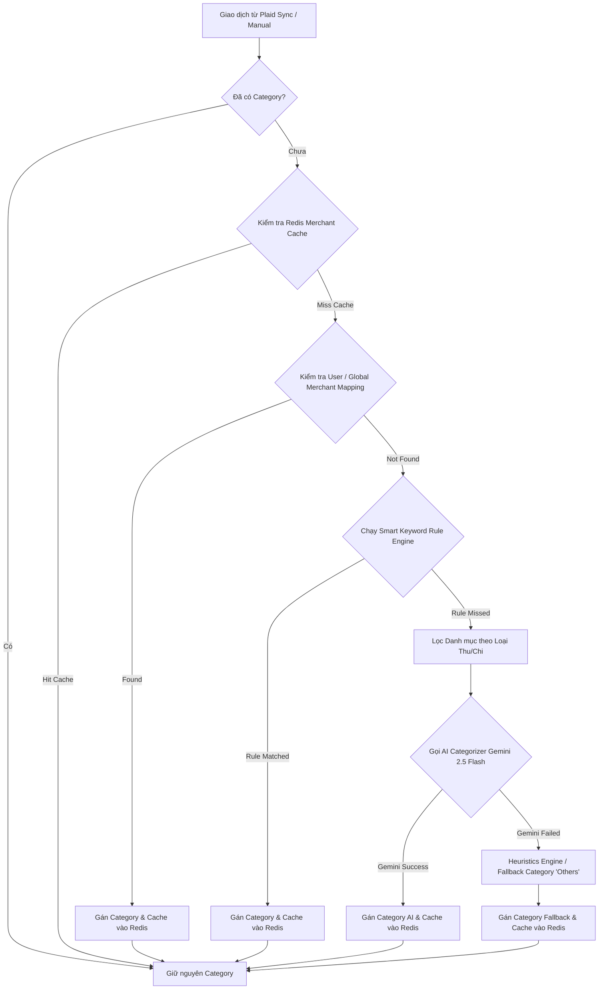
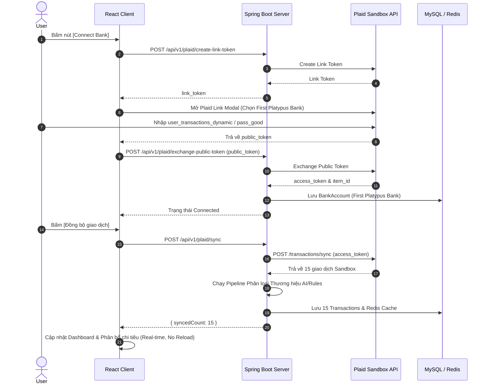
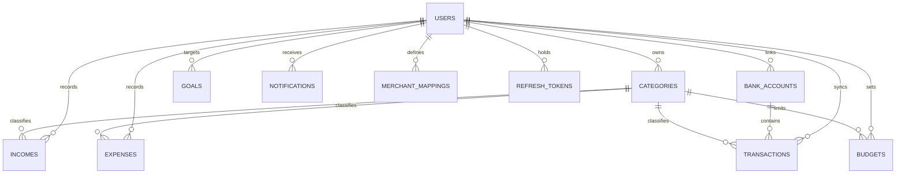

# Software Requirements Specification (SRS)
## Dự án: Smart Finance (Personal Finance Management System)

Phiên bản tài liệu: **2.0**  
Thời gian cập nhật: **20/07/2026**  
Chuẩn tham chiếu: **IEEE 29148 (Software Requirements Specification)**

## Mục lục

| STT | Nội dung |
|---|---|
| 1 | Introduction |
| 2 | Overall Description |
| 3 | Project Scope |
| 4 | Technology Stack |
| 5 | System Architecture |
| 6 | Business Process |
| 7 | User Roles |
| 8 | Functional Requirements |
| 9 | Non Functional Requirements |
| 10 | Entity Specification |
| 11 | Database Design |
| 12 | API Specification |
| 13 | Authentication Flow |
| 14 | Validation Rules |
| 15 | Business Rules |
| 16 | Error Handling |
| 17 | Logging |
| 18 | Security |
| 19 | Testing |
| 20 | Deployment |
| 21 | Future Enhancement |
| 22 | Appendix |

---

## 1. Introduction

### 1.1 Mục đích tài liệu
Tài liệu **Software Requirements Specification (SRS)** này đặc tả chi tiết toàn bộ các yêu cầu phần mềm, kiến trúc hệ thống, luồng nghiệp vụ, mô hình dữ liệu, hợp đồng API và chính sách bảo mật cho ứng dụng **Smart Finance** (Website Quản lý Tài chính Cá nhân Thông minh). Tài liệu đóng vai trò là chuẩn kỹ thuật chính thức giữa Product Owner, System Analyst, Developers, QA Engineers và DevOps Engineers trong quá trình xây dựng, nghiệm thu và bảo trì dự án.

### 1.2 Phạm vi tài liệu
Tài liệu bao phủ toàn bộ các phân hệ chức năng và phi chức năng đã được hiện thực hóa trong ứng dụng Smart Finance:
- Phân hệ Xác thực & Phân quyền (JWT Stateless, Google OAuth2, Quên mật khẩu OTP Email qua Redis, Redis Blacklist Token).
- Tích hợp Ngân hàng giả lập **Plaid Sandbox** (Hỗ trợ kết nối ngân hàng **First Platypus Bank**, trao đổi token và đồng bộ giao dịch tự động).
- Pipeline Phân loại Thương hiệu Đa tầng (Redis Merchant Cache $\rightarrow$ User/Global Merchant Mapping $\rightarrow$ Smart Rule Engine $\rightarrow$ AI Categorizer Gemini 2.5 Flash $\rightarrow$ Fallback).
- Phân hệ Dashboard & Phân tích Chi tiêu (Tổng số dư, Thu/Chi tháng, Biểu đồ xu hướng tuần, Card **Phân bổ chi tiêu** kết hợp cả giao dịch thủ công lẫn ngân hàng Plaid và làm nổi bật **Chi nhiều nhất - Top Category Highlight**).
- Phân hệ Quản lý Ngân sách (Budgets), Mục tiêu Tiết kiệm (Saving Goals), Hóa đơn định kỳ (Upcoming Bills) và Thông báo (Notifications).
- Phân hệ Tiền tệ & Tỉ giá Tự động (`ExchangeRateScheduler` hỗ trợ VND, USD, EUR, JPY).
- Chính sách Khởi tạo Dữ liệu Sạch (**Clean DataSeeder Policy**).

### 1.3 Đối tượng sử dụng tài liệu
Tài liệu dành cho toàn bộ đội ngũ kỹ thuật dự án, bao gồm Frontend Engineers, Backend Engineers, QA/QC Engineers, System Architects và các bên quản trị sản phẩm.

### 1.4 Thuật ngữ và chữ viết tắt
| Thuật ngữ | Diễn giải |
|---|---|
| SRS | Software Requirements Specification |
| JWT | JSON Web Token (Access Token & Refresh Token) |
| Plaid Sandbox | Môi trường thử nghiệm liên kết tài khoản ngân hàng thử nghiệm |
| First Platypus Bank | Ngân hàng Sandbox mặc định dùng để đồng bộ giao dịch thử nghiệm |
| Merchant | Thương hiệu / Nhà cung cấp trong giao dịch (OpenAI, Apple, Netflix, Spotify, Starbucks) |
| TTL | Time To Live (Thời gian lưu cache tự xóa trong Redis) |
| OTP | One-Time Password (Mã xác thực một lần qua Email) |
| CRUD | Create, Read, Update, Delete |
| DTO | Data Transfer Object |
| JPA | Java Persistence API |

### 1.5 Tài liệu tham chiếu
Tài liệu tham chiếu bao gồm đặc tả công nghệ: React 18, TypeScript, Vite, Vanilla CSS, Java 21, Spring Boot 3.x, Spring Security, Spring Data JPA, MySQL 8.0, Redis, Plaid Java SDK, Google Gemini 2.5 Flash API, IEEE 29148.

### 1.6 Tổng quan cấu trúc tài liệu
Tài liệu được bố cục chặt chẽ theo đúng 22 mục chuẩn IEEE 29148 từ Mô tả tổng quan, Ngăn xếp công nghệ, Kiến trúc, Luồng nghiệp vụ, Phân hệ chức năng, Thực thể & CSDL, Đặc tả API cho đến Bảo mật, Kiểm thử và Triển khai.

---

## 2. Overall Description

### 2.1 Bối cảnh sản phẩm
Smart Finance được xây dựng nhằm giải quyết bài toán theo dõi tài chính cá nhân bị ngắt quãng do nhập liệu thủ công. Bằng cách tích hợp ngân hàng tự động Plaid Sandbox và bộ phân loại AI/Rules thông minh, hệ thống giúp người dùng kiểm soát dòng tiền, ngân sách và bức tranh tài chính thời gian thực.

### 2.2 Chức năng tổng quát của sản phẩm
- **Quản lý Tài khoản & Bảo mật**: Đăng ký, Đăng nhập, Google OAuth2, Quên mật khẩu OTP Email (gửi HTML email, băm BCrypt lưu Redis 5 phút, giới hạn rate-limit), Đăng xuất an toàn đưa Access Token vào Redis Blacklist.
- **Tích hợp Ngân hàng Plaid Sandbox**: Mở Plaid Link modal kết nối ngân hàng **First Platypus Bank** (`user_good` / `pass_good`), đổi `public_token` lấy `access_token`, đồng bộ 15 giao dịch ngân hàng thử nghiệm.
- **Phân loại Giao dịch Đa tầng**:
  - `OpenAI` $\rightarrow$ **Utilities** (Dịch vụ / Công nghệ)
  - `Apple` $\rightarrow$ **Shopping** (Mua sắm)
  - `Interest payment` $\rightarrow$ **Interest / Income** (Thu nhập / Tiền lãi)
  - `Spotify` / `Netflix` $\rightarrow$ **Entertainment** (Giải trí)
  - `Royal Farms` / `Sweetgreen` / `Smart & Final` $\rightarrow$ **Food** (Ăn uống)
- **Dashboard & Phân bổ Chi tiêu**: Hiển thị tổng số dư, thu chi tháng, giao dịch mới nhất, biểu đồ xu hướng tuần và card **Phân bổ chi tiêu** hiển thị % danh mục kèm badge làm nổi bật **Danh mục chi nhiều nhất (Top Category Highlight)** mà không cần reload trang.
- **Quản lý Ngân sách & Mục tiêu**: Thiết lập hạn mức chi tiêu theo danh mục (thanh tiến trình cảnh báo đổi màu khi quá 80%), tạo mục tiêu tích lũy tài sản.
- **Đa tiền tệ & Tỉ giá**: Tự động quét cập nhật tỷ giá theo lịch trình `ExchangeRateScheduler`, cho phép chuyển đổi Tiền tệ hiển thị (Display Currency).

### 2.3 Nhóm người dùng
Người dùng cá nhân có nhu cầu theo dõi thu chi, liên kết tài khoản ngân hàng tự động và quản lý ngân sách thông minh. Mỗi người dùng có không gian dữ liệu hoàn toàn riêng biệt.

### 2.4 Môi trường vận hành
- **Frontend**: Trình duyệt web hiện đại (Chrome, Edge, Firefox, Safari) hỗ trợ React SPA & Vanilla CSS Dark Mode.
- **Backend**: Máy chủ Java 21, Spring Boot 3.x.
- **Database & Cache**: MySQL 8.0 cho dữ liệu lâu dài và Redis Server cho OTP, Token Blacklist và Merchant Cache.

### 2.5 Ràng buộc thiết kế và triển khai
Giao diện bắt buộc thiết kế theo chuẩn Dark Theme, Glassmorphism, Neon Blue Cyber, bảo đảm responsive 100% trên cả Desktop và Mobile.

### 2.6 Giả định và phụ thuộc
Hệ thống kết nối đến môi trường Plaid Sandbox (`https://sandbox.plaid.com`) và API Google Gemini 2.5 Flash với kết nối Internet ổn định.

---

## 3. Project Scope

### 3.1 Mục tiêu nghiệp vụ
- Tự động hóa 90% việc ghi nhận và phân loại giao dịch tài chính từ ngân hàng.
- Cung cấp cái nhìn trực quan về xu hướng dòng tiền và danh mục chi tiêu cao nhất.
- Bảo đảm an toàn thông tin tài khoản qua xác thực đa tầng và mã hóa JWT/BCrypt.

### 3.2 Phạm vi trong dự án
Bao gồm toàn bộ các module Xác thực, OAuth2, OTP Email, Plaid Sandbox (**First Platypus Bank**), Merchant Categorization Pipeline, Incomes, Expenses, Categories, Dashboard (Top Category Highlight), Budgets, Goals, Notifications, Exchange Rates và Clean DataSeeder Policy.

### 3.3 Phạm vi ngoài dự án
Không bao gồm kết nối ngân hàng tiền thật thật (Production Plaid/VN Banks) và giao dịch chuyển tiền trực tiếp giữa các ngân hàng.

### 3.4 Tiêu chí hoàn thành phạm vi
Tất cả các chức năng được triển khai 100%, tích hợp kiểm thử thành công, ứng dụng chạy mượt mà không lỗi runtime.

---

## 4. Technology Stack

| Tầng | Công nghệ / Thư viện | Vai trò & Mô tả |
|---|---|---|
| Frontend | React (TypeScript), Vite | Xây dựng Single Page Application render tốc độ cao |
| Styling | Vanilla CSS (Dark/Glassmorphism) | Thiết kế Dark Cyber sang trọng, hiệu ứng chuyển động mượt mà |
| State & HTTP | Axios Interceptor, React Hooks | Quản lý token, gọi API và xử lý lỗi tự động |
| Plaid Client | `react-plaid-link` & `plaid-java` | Tích hợp luồng Plaid Link và API trao đổi Token ngân hàng Sandbox |
| Backend | Java 21, Spring Boot 3.x | Nền tảng server và xử lý logic nghiệp vụ |
| Security | Spring Security, JWT, BCrypt, OAuth2 Client | Xác thực API stateless, hỗ trợ Google OAuth2 Login |
| Cache & Storage | Redis (`StringRedisTemplate`), MySQL 8.0 | Cache phân loại merchant (30 ngày), băm OTP, JWT Blacklist |
| AI Integration | Google Gemini 2.5 Flash API | Phân loại ngữ nghĩa thương hiệu giao dịch tự động |

---

## 5. System Architecture

### 5.1 Kiến trúc tổng quan
Hệ thống tuân theo mô hình Client-Server phân tầng rõ rệt:

```
[ React SPA Client ] <--- HTTPS / REST API + JWT ---> [ Spring Boot REST Controllers ]
                                                               |
                                            +------------------+------------------+
                                            |                  |                  |
                                     [ MySQL 8.0 DB ]   [ Redis Server ]   [ Plaid / Gemini API ]
```

### 5.2 Luồng Phân loại Thương hiệu Đa tầng (Classification Pipeline)



---

## 6. Business Process

### 6.1 Luồng Kết nối & Đồng bộ Ngân hàng Plaid Sandbox (First Platypus Bank)



---

## 7. User Roles

### 7.1 Guest (Người dùng vãng lai)
- Được phép: Đăng ký tài khoản mới, Đăng nhập email/mật khẩu, Đăng nhập Google OAuth2, Yêu cầu gửi OTP khôi phục mật khẩu.

### 7.2 Authenticated User (Người dùng đã đăng nhập)
- Được phép: 
  - Liên kết và hủy liên kết ngân hàng Plaid Sandbox (**First Platypus Bank**).
  - Đồng bộ giao dịch tự động.
  - Quản lý danh mục (`Categories`), thu nhập (`Incomes`), chi tiêu (`Expenses`).
  - Xem Dashboard, Biểu đồ tuần, Card **Phân bổ chi tiêu** (có Top Category Highlight).
  - Quản lý Ngân sách (`Budgets`), Mục tiêu (`Goals`), Hóa đơn (`Bills`), Thông báo (`Notifications`).
  - Thay đổi tiền tệ hiển thị (VND, USD, EUR, JPY) và Đổi mật khẩu.

---

## 8. Functional Requirements

### 8.1 Module Authentication & OTP Security
- **Register**: Đăng ký tài khoản với email duy nhất, băm mật khẩu BCrypt. Tự động khởi tạo bộ **Danh mục chuẩn** (Salary, Bonus, Food, Transport, Shopping, Utilities, Health, Entertainment, Interest) với 0 giao dịch giả rác.
- **Login & OAuth2**: Đăng nhập mật khẩu hoặc Google OAuth2, phát hành cặp JWT Access Token (15 phút) và Refresh Token (7 ngày).
- **Forgot Password OTP**: Gửi mã OTP 6 số qua HTML Email, băm BCrypt lưu Redis 5 phút (TTL), chống Brute-force (tối đa 5 lần thử), Rate-limit (1 lần/phút, 5 lần/giờ).
- **Logout & Blacklist**: Thu hồi Refresh Token trong CSDL và đưa Access Token vào **Redis Blacklist** ngăn chặn sử dụng lại lập tức.

### 8.2 Module Plaid Sandbox Integration
- **Create Link Token**: Khởi tạo phiên liên kết Plaid Sandbox.
- **Exchange Public Token**: Tiếp nhận `public_token` từ ngân hàng **First Platypus Bank**, trao đổi lấy `access_token` mã hóa lưu CSDL.
- **Sync Transactions**: Tải 15 giao dịch động, tự động phân loại thương hiệu và cập nhật số dư tài khoản.

### 8.3 Module Categorization Pipeline & AI
- **Smart Rule Engine**: Phân loại chuẩn xác các thương hiệu phổ biến:
  - `OpenAI`, `ChatGPT`, `Google`, `Microsoft` $\rightarrow$ **Utilities**
  - `Apple`, `Amazon`, `Shopee`, `Adidas` $\rightarrow$ **Shopping**
  - `Interest payment`, `dividend`, `tiền lãi` $\rightarrow$ **Interest / Income**
  - `Spotify`, `Netflix`, `Steam` $\rightarrow$ **Entertainment**
  - `Royal Farms`, `Sweetgreen`, `Smart & Final` $\rightarrow$ **Food**
- **AI Categorizer Gemini 2.5 Flash**: Phân loại theo ngữ nghĩa văn bản khi thương hiệu nằm ngoài bộ quy tắc.
- **Redis Cache**: Lưu kết quả phân loại merchant theo user (TTL 30 ngày).

### 8.4 Module Dashboard & Expense Distribution
- Tổng hợp chỉ số: Tổng số dư, Thu nhập tháng, Chi tiêu tháng, Tỷ lệ tiết kiệm.
- **Phân bổ chi tiêu (Category Distribution)**:
  - Tổng hợp dữ liệu từ **cả giao dịch nhập thủ công lẫn giao dịch đồng bộ ngân hàng Plaid**.
  - Hiển thị tổng % đã chi trên biểu đồ Donut.
  - Hiển thị **Badge làm nổi bật Danh mục chi nhiều nhất**: `Chi nhiều nhất: Utilities (38.5%)`.
  - Danh sách từng danh mục kèm thanh tiến trình phân màu sinh động.
  - Cập nhật thời gian thực mà KHÔNG cần reload trang.

---

## 9. Non Functional Requirements

1. **Hiệu năng (Performance)**: Thời gian phản hồi API đồng bộ và phân loại $< 1.5$s nhờ Redis Cache. Chuyển đổi dữ liệu giao diện không làm lag trang.
2. **Bảo mật (Security)**: Mật khẩu băm BCrypt, Access Token Plaid được bảo vệ mã hóa, Token thu hồi lập tức qua Redis Blacklist.
3. **Độ tin cậy (Reliability)**: Tự động rollback transaction CSDL nếu xảy ra lỗi trong quá trình lưu trữ.
4. **Giao diện (Usability/Design)**: Dark Theme, Glassmorphism, Neon Blue Cyber, responsive 100%.

---

## 10. Entity Specification

1. `User`: Quản lý thông tin tài khoản, email, mật khẩu băm, tiền tệ hiển thị, trạng thái.
2. `BankAccount`: Quản lý tài khoản ngân hàng liên kết Plaid (Bank Name: *First Platypus Bank*, Plaid Account ID, Balance, Currency).
3. `Transaction`: Giao dịch ngân hàng đồng bộ từ Plaid (Plaid Transaction ID, Merchant Name, Amount, Date, Category, Type).
4. `Category`: Danh mục phân loại thu/chi (Name, Type: `INCOME`/`EXPENSE`, User).
5. `Income`: Giao dịch thu nhập nhập thủ công.
6. `Expense`: Giao dịch chi tiêu nhập thủ công.
7. `Budget`: Hạn mức chi tiêu theo danh mục (Limit Amount, Spend Amount, Period).
8. `Goal`: Mục tiêu tiết kiệm (Target Amount, Current Amount, Target Date).
9. `Notification`: Thông báo cảnh báo hệ thống/ngân sách.
10. `MerchantMapping`: Ánh xạ thương hiệu sang danh mục của người dùng/toàn cục.
11. `ExchangeRate`: Tỉ giá quy đổi tiền tệ (Base Currency, Target Currency, Rate).
12. `RefreshToken`: Quản lý token làm mới phiên đăng nhập.

---

## 11. Database Design

### 11.1 Sơ đồ ERD Cơ sở Dữ liệu



---

## 12. API Specification

| Endpoint | Method | Mô tả |
|---|:---:|---|
| `/api/v1/auth/register` | `POST` | Đăng ký tài khoản mới (khởi tạo danh mục chuẩn, 0 giao dịch rác) |
| `/api/v1/auth/login` | `POST` | Đăng nhập trả JWT Access & Refresh Token |
| `/api/v1/auth/forgot-password` | `POST` | Yêu cầu gửi OTP qua Email (Redis 5 phút TTL) |
| `/api/v1/auth/verify-otp` | `POST` | Xác thực mã OTP |
| `/api/v1/auth/reset-password` | `POST` | Đổi mật khẩu mới và thu hồi phiên |
| `/api/v1/auth/logout` | `POST` | Đăng xuất, đưa Access Token vào Redis Blacklist |
| `/api/v1/plaid/create-link-token` | `POST` | Tạo Link Token kết nối Plaid Sandbox |
| `/api/v1/plaid/exchange-public-token` | `POST` | Đổi public_token lấy access_token ngân hàng **First Platypus Bank** |
| `/api/v1/plaid/sync` | `POST` | Đồng bộ 15 giao dịch Sandbox & tự động phân loại AI/Rules |
| `/api/v1/dashboard` | `GET` | Lấy dữ liệu Dashboard & **Phân bổ chi tiêu (categoryDistribution)** |
| `/api/v1/categories` | `GET/POST/PUT/DELETE` | CRUD danh mục thu/chi |
| `/api/v1/incomes` | `GET/POST/PUT/DELETE` | CRUD thu nhập |
| `/api/v1/expenses` | `GET/POST/PUT/DELETE` | CRUD chi tiêu |
| `/api/v1/budgets` | `GET/POST/DELETE` | Quản lý ngân sách |
| `/api/v1/goals` | `GET/POST/PUT/DELETE` | Quản lý mục tiêu tiết kiệm |
| `/api/v1/notifications` | `GET/POST` | Truy xuất và đánh dấu đọc thông báo |
| `/api/exchange-rate` | `GET` | Truy xuất danh sách tỉ giá tự động |

---

## 13. Authentication Flow

1. **Đăng nhập**: Người dùng nhập Email + Mật khẩu $\rightarrow$ Backend kiểm tra BCrypt $\rightarrow$ Phát hành JWT Access Token + Refresh Token.
2. **Ủy quyền API**: Frontend gửi Access Token trong Header `Authorization: Bearer <token>`. `JwtAuthenticationFilter` kiểm tra chữ ký và đối chiếu với **Redis Blacklist**.
3. **Đăng xuất**: Access Token được ghi vào Redis Blacklist với TTL bằng thời gian sống còn lại của Token. Refresh Token bị vô hiệu hóa trong CSDL.

---

## 14. Validation Rules

- Email: Đúng định dạng RFC 5322, duy nhất.
- Password: Độ dài tối thiểu 8 ký tự.
- Amount: Phải lớn hơn 0 (`amount > 0`).
- Date: Định dạng ISO `YYYY-MM-DD`, không lớn hơn ngày hiện tại đối với giao dịch quá khứ.
- OTP: 6 chữ số, thời gian hiệu lực 5 phút.

---

## 15. Business Rules

1. Tài khoản mới tạo hoặc đăng nhập Google OAuth2 lần đầu chỉ sinh danh mục chuẩn, không tự động sinh giao dịch thu/chi lịch sử giả lập.
2. Đồng bộ Plaid tự động re-classify các giao dịch cũ bằng bộ quy tắc mới nhất để sửa lỗi phân loại sai.
3. Phân bổ chi tiêu trên Dashboard phải gom nhóm dữ liệu của cả hai bảng `Expense` và `Transaction`.

---

## 16. Error Handling

- Chuẩn hóa định dạng phản hồi lỗi API:
```json
{
  "success": false,
  "message": "Thông báo lỗi chi tiết",
  "code": "ERROR_CODE",
  "timestamp": "2026-07-20T12:00:00"
}
```
- Các mã lỗi phổ biến: `400 Bad Request`, `401 Unauthorized`, `403 Forbidden`, `404 Not Found`, `409 Conflict`, `500 Internal Server Error`.

---

## 17. Logging

- Sử dụng `Slf4j` với Logback.
- Ghi vết sự kiện xác thực, đồng bộ Plaid, phân loại AI/Rules, lỗi kết nối và sự kiện bảo mật.

---

## 18. Security

- Mã hóa mật khẩu bằng BCrypt.
- Mã hóa lưu trữ Access Token Plaid.
- Chống spam OTP bằng Redis Rate-Limiter (1 phút/lần, 5 lần/giờ).
- Chống Brute-force OTP (hủy OTP sau 5 lần nhập sai).
- Vô hiệu hóa JWT ngay lập tức qua Redis Blacklist khi logout.

---

## 19. Testing

- Kiểm thử đơn vị (Unit Test) với JUnit5 & Mockito cho các Service phân loại thương hiệu và tính toán tỉ giá.
- Kiểm thử tích hợp (Integration Test) với Spring Boot Test & MockMvc cho API Auth, Plaid Sync và Dashboard.

---

## 20. Deployment

- Triển khai Backend Spring Boot dưới dạng Docker Container hoặc JAR độc lập trên Java 21 Runtime.
- Triển khai Frontend React dưới dạng các file tĩnh tối ưu hóa qua Vite Build.
- Kết nối CSDL MySQL 8.0 và Redis Server 7.x.

---

## 21. Future Enhancement

- Tích hợp thêm các ngân hàng nội địa Việt Nam qua Gateway Open Banking.
- Tự động nhận diện và nhắc nhở Hóa đơn định kỳ hàng tháng bằng AI.
- Phân tích dự báo số dư và cảnh báo nguy cơ thâm hụt tài chính bằng Machine Learning.

---

## 22. Appendix

- Tài liệu hướng dẫn Demo Plaid Sandbox: [docs/sandbox-demo.md](file:///d:/code/fullstack/Personal%20Finance%20Management/docs/sandbox-demo.md)
- Sơ đồ luồng giao diện thời gian thực: [docs/sandbox-flow.md](file:///d:/code/fullstack/Personal%20Finance%20Management/docs/sandbox-flow.md)
- Báo cáo tiến độ dự án: [docs/project-progress.md](file:///d:/code/fullstack/Personal%20Finance%20Management/docs/project-progress.md)