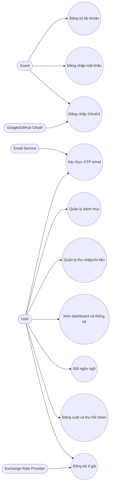
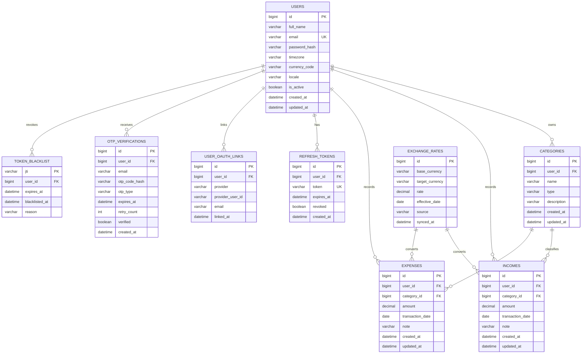
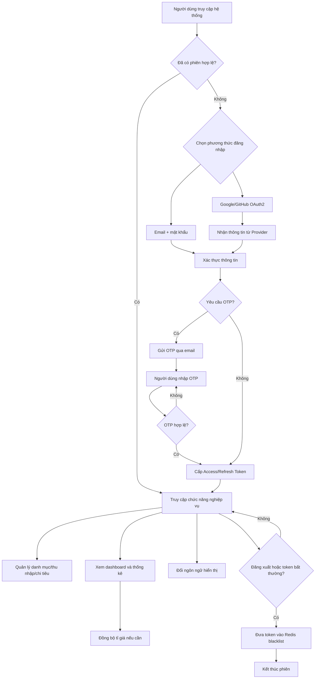

# Software Requirements Specification (SRS)
## Dự án: Smart Finance

Phiên bản tài liệu: 1.1  
Thời gian cập nhật: 15:20 | 13/07/2026  
Chuẩn tham chiếu: IEEE 29148 (Software Requirements Specification)

## Mục lục

| STT | Nội dung |
|---|---|
| 1 | Introduction |
| 2 | Overall Description |
| 3 | Project Scope |
| 4 | Technology Stack |
| 5 | System Architecture |
| 6 | Business Process |
| 7 | User Roles |
| 8 | Functional Requirements |
| 9 | Non Functional Requirements |
| 10 | Entity Specification |
| 11 | Database Design |
| 12 | API Specification |
| 13 | Authentication Flow |
| 14 | Validation Rules |
| 15 | Business Rules |
| 16 | Error Handling |
| 17 | Logging |
| 18 | Security |
| 19 | Testing |
| 20 | Deployment |
| 21 | Future Enhancement |
| 22 | Appendix |

## 1. Introduction

### 1.1 Mục đích tài liệu
Tài liệu này đặc tả đầy đủ yêu cầu phần mềm cho hệ thống Smart Finance, một website quản lý tài chính cá nhân theo kiến trúc Client - Server. Tài liệu đóng vai trò chuẩn thống nhất giữa nghiệp vụ, phân tích hệ thống, thiết kế, phát triển, kiểm thử và vận hành. Mọi chức năng, ràng buộc nghiệp vụ, quy tắc xác thực dữ liệu, thiết kế dữ liệu, API và yêu cầu phi chức năng được mô tả theo mức chi tiết đủ để triển khai và kiểm thử.

### 1.2 Phạm vi tài liệu
Tài liệu bao phủ toàn bộ các yêu cầu thuộc phiên bản nền tảng của Smart Finance, bao gồm xác thực và phân quyền người dùng, quản lý danh mục, quản lý thu nhập, quản lý chi tiêu, dashboard tổng quan, thống kê tài chính, quản lý hồ sơ người dùng, bảo mật, logging, kiểm thử và triển khai. Những nội dung ngoài phạm vi phiên bản hiện tại sẽ được nêu rõ tại mục Future Enhancement.

### 1.3 Đối tượng sử dụng tài liệu
Tài liệu dành cho Product Owner, Business Analyst, Solution Architect, Backend Developer, Frontend Developer, QA Engineer, DevOps Engineer và các bên liên quan quản trị dự án cần căn cứ kỹ thuật và nghiệp vụ để ra quyết định.

### 1.4 Thuật ngữ và chữ viết tắt

| Thuật ngữ | Diễn giải |
|---|---|
| SRS | Software Requirements Specification |
| JWT | JSON Web Token, token truy cập ngắn hạn dùng xác thực API |
| Refresh Token | Token dùng để cấp lại JWT khi JWT hết hạn |
| CRUD | Create, Read, Update, Delete |
| API | Application Programming Interface |
| DTO | Data Transfer Object |
| JPA | Java Persistence API |
| NFR | Non Functional Requirement |

### 1.5 Tài liệu tham chiếu
Tài liệu tham chiếu bao gồm đặc tả công nghệ của React, TypeScript, Vite, TailwindCSS, Redux Toolkit, Axios, React Router, Lucide React, Java 21, Spring Boot, Spring Security, Spring Data JPA, JWT, MySQL, Redis, Lombok, MapStruct, Gradle, JUnit5, Mockito, Spring Boot Test và MockMvc.

### 1.6 Tổng quan cấu trúc tài liệu
Phần còn lại của tài liệu lần lượt trình bày mô tả tổng thể hệ thống, phạm vi dự án, ngăn xếp công nghệ, kiến trúc, quy trình nghiệp vụ, vai trò người dùng, yêu cầu chức năng, yêu cầu phi chức năng, đặc tả thực thể, thiết kế cơ sở dữ liệu, đặc tả API, luồng xác thực, quy tắc kiểm tra dữ liệu, quy tắc nghiệp vụ, xử lý lỗi, logging, bảo mật, kiểm thử, triển khai, định hướng mở rộng và phụ lục.

## 2. Overall Description

### 2.1 Bối cảnh sản phẩm
Smart Finance là hệ thống web hỗ trợ người dùng cá nhân theo dõi thu nhập, chi tiêu, số dư hiện tại và xu hướng tài chính theo thời gian. Hệ thống được xây dựng theo mô hình tách biệt frontend và backend, giúp tăng khả năng mở rộng, dễ bảo trì và tối ưu trải nghiệm người dùng trên nhiều kích thước thiết bị.

### 2.2 Chức năng tổng quát của sản phẩm
Hệ thống cung cấp quy trình đầy đủ từ đăng ký tài khoản đến quản lý giao dịch và phân tích tài chính. Người dùng có thể tạo và quản lý danh mục, ghi nhận thu nhập và chi tiêu theo từng thời điểm, tìm kiếm và phân trang dữ liệu lịch sử, xem dashboard tổng hợp và thống kê theo tháng, năm, danh mục. Hệ thống cung cấp quản lý hồ sơ người dùng, đổi mật khẩu, đăng xuất an toàn và cơ chế refresh token để duy trì phiên làm việc hợp lệ. Phiên bản mở rộng hỗ trợ liên kết tài khoản đăng nhập Google/GitHub, xác thực OTP qua email, cập nhật tỉ giá để quy đổi đa tiền tệ, thay đổi ngôn ngữ giao diện và blacklist token bằng Redis.

### 2.3 Nhóm người dùng
Sản phẩm phục vụ người dùng cuối là cá nhân có nhu cầu quản lý tài chính. Mỗi tài khoản quản lý dữ liệu riêng tư của chính mình theo cơ chế đa người dùng tách biệt dữ liệu.

### 2.4 Môi trường vận hành
Frontend vận hành trên trình duyệt hiện đại hỗ trợ JavaScript ES2022 và CSS hiện đại. Backend chạy trên Java 21 với Spring Boot. Dữ liệu lưu trữ bằng MySQL cho môi trường phát triển, staging và production. Redis được sử dụng cho blacklist token và dữ liệu tạm thời bảo mật. Triển khai có thể thực hiện trên một máy chủ ứng dụng độc lập hoặc container hóa.

### 2.5 Ràng buộc thiết kế và triển khai
Ràng buộc công nghệ đã được xác định: React + TypeScript + Vite + TailwindCSS + Redux Toolkit ở phía client; Spring Boot + Spring Security + JPA + JWT + MySQL + Redis ở phía server. Thiết kế UI bắt buộc theo Dark Theme, Glassmorphism, Neon Blue và bảo đảm responsive.

### 2.6 Giả định và phụ thuộc
Hệ thống giả định người dùng truy cập bằng thiết bị có kết nối internet ổn định, thời gian hệ thống máy chủ được đồng bộ chuẩn UTC hoặc múi giờ đã cấu hình, và các thư viện bảo mật được cập nhật định kỳ để tránh lỗ hổng đã biết.

## 3. Project Scope

### 3.1 Mục tiêu nghiệp vụ
Smart Finance nhằm giúp người dùng cá nhân giảm thất thoát tài chính, hình thành thói quen ghi nhận giao dịch thường xuyên, quan sát xu hướng chi tiêu theo danh mục và đưa ra quyết định tài chính dựa trên dữ liệu định lượng.

### 3.2 Phạm vi trong dự án
Phạm vi triển khai bao gồm các module xác thực, quản lý hồ sơ, danh mục, thu nhập, chi tiêu, dashboard, thống kê, logging, bảo mật API, kiểm thử backend và giao diện responsive theo định hướng thiết kế đã nêu.

### 3.3 Phạm vi ngoài dự án
Phiên bản hiện tại không bao gồm tích hợp ngân hàng tự động, đồng bộ đa tiền tệ nâng cao, lập kế hoạch đầu tư, trợ lý AI tư vấn tài chính, chia sẻ ngân sách nhóm gia đình theo thời gian thực và ứng dụng di động native.

### 3.4 Tiêu chí hoàn thành phạm vi
Phạm vi được xem là hoàn thành khi toàn bộ yêu cầu chức năng và phi chức năng trong tài liệu này được hiện thực, kiểm thử đạt, dữ liệu được quản lý đúng ràng buộc nghiệp vụ và API đáp ứng đầy đủ hợp đồng đầu vào đầu ra theo đặc tả.

## 4. Technology Stack

| Tầng | Công nghệ | Vai trò |
|---|---|---|
| Frontend | ReactJS | Xây dựng giao diện component-based |
| Frontend | TypeScript | Bảo đảm kiểu dữ liệu tĩnh, giảm lỗi runtime |
| Frontend | Vite | Build tool, dev server tốc độ cao |
| Frontend | TailwindCSS | Thiết kế giao diện Dark/Glassmorphism/Responsive |
| Frontend | Redux Toolkit | Quản lý state toàn cục và side effect |
| Frontend | Axios | Gọi API HTTP và xử lý interceptor token |
| Frontend | React Router | Điều hướng và bảo vệ route |
| Frontend | Lucide React | Bộ icon thống nhất ngôn ngữ giao diện |
| Backend | Java 21 | Nền tảng ngôn ngữ |
| Backend | Spring Boot | Khung ứng dụng backend |
| Backend | Spring Security | Xác thực, phân quyền, bảo vệ endpoint |
| Backend | Spring Data JPA | Truy cập dữ liệu theo mô hình repository |
| Backend | JWT | Access token cho xác thực stateless |
| Backend | MySQL | Cơ sở dữ liệu quan hệ chính |
| Backend | Redis | Blacklist token và lưu trữ dữ liệu phiên ngắn hạn |
| Backend | Lombok | Giảm mã lặp trong model/service |
| Backend | MapStruct | Ánh xạ Entity và DTO hiệu năng cao |
| Backend | Gradle | Quản lý build và dependency |
| Testing | JUnit5 | Unit test và integration test |
| Testing | Mockito | Mock dependency trong unit test |
| Testing | Spring Boot Test | Tải ngữ cảnh ứng dụng để test tích hợp |
| Testing | MockMvc | Kiểm thử API controller không cần deploy |

## 5. System Architecture

### 5.1 Kiến trúc tổng quan
Hệ thống áp dụng kiến trúc Client - Server tách lớp rõ ràng. Client React chịu trách nhiệm hiển thị, tương tác người dùng, quản lý state và giao tiếp API. Server Spring Boot xử lý nghiệp vụ, xác thực JWT, kiểm soát quyền truy cập và truy xuất dữ liệu qua JPA. MySQL là lớp lưu trữ lâu dài cho dữ liệu nghiệp vụ và token làm mới; Redis giữ danh sách token bị thu hồi để chặn truy cập tức thời.

### 5.2 Vai trò module frontend
Module Authentication ở frontend quản lý đăng nhập, đăng ký, duy trì phiên và điều hướng bảo vệ trang. Module Finance quản lý danh mục, thu nhập, chi tiêu, tìm kiếm và phân trang. Module Dashboard tổng hợp chỉ số tức thời và giao dịch gần đây. Module Statistics trực quan hóa dữ liệu theo tháng, năm và danh mục. Module User Settings quản lý hồ sơ và đổi mật khẩu. Các module dùng chung Redux store để chia sẻ trạng thái người dùng và bộ lọc dữ liệu, đồng thời dùng Axios interceptor để tự động gửi access token và xử lý refresh token.

### 5.3 Vai trò module backend
Module Security kiểm soát xác thực, cấp phát và kiểm tra JWT, vòng đời refresh token và ngữ cảnh người dùng hiện tại. Module User quản lý hồ sơ và thay đổi mật khẩu. Module Category quản lý danh mục riêng từng người dùng. Module Income và Expense xử lý CRUD, tìm kiếm và phân trang giao dịch. Module Dashboard tổng hợp số liệu hiện tại. Module Statistics thực hiện truy vấn tổng hợp theo các chiều thời gian và danh mục. Module Exception Handling chuẩn hóa phản hồi lỗi. Module Logging ghi lại sự kiện kỹ thuật và bảo mật.

### 5.4 Quan hệ giữa các module
Module Authentication là điểm vào của toàn hệ thống và cung cấp danh tính cho các module nghiệp vụ còn lại. Module Category phụ thuộc vào User để xác định quyền sở hữu dữ liệu. Module Income và Expense phụ thuộc vào Category để phân loại giao dịch. Module Dashboard và Statistics phụ thuộc dữ liệu từ Income và Expense để tạo chỉ số tổng hợp. Module User duy trì thông tin hồ sơ phục vụ hiển thị cá nhân hóa và an toàn tài khoản.

### 5.5 Kiến trúc dữ liệu
Mỗi bản ghi Category, Income và Expense được gắn với một User cụ thể để bảo đảm phân tách dữ liệu đa người dùng. Bảng RefreshToken quản lý phiên làm việc dài hạn và cho phép thu hồi token khi logout hoặc khi phát hiện bất thường.

### 5.6 Use Case tổng quan

### 5.7 Sơ đồ ERD tổng quan

### 5.8 Sơ đồ luồng hệ thống tổng quan

## 6. Business Process

### 6.1 Luồng đăng ký tài khoản

| Thành phần | Mô tả |
|---|---|
| Actor | Người dùng chưa có tài khoản |
| Trigger | Người dùng chọn chức năng đăng ký và gửi biểu mẫu |
| Main Flow | Hệ thống nhận thông tin, kiểm tra định dạng, kiểm tra trùng email, mã hóa mật khẩu, tạo tài khoản mới, trả kết quả thành công và hướng người dùng đến đăng nhập. |
| Alternative Flow | Nếu email đã tồn tại, hệ thống từ chối tạo tài khoản và yêu cầu dùng email khác. |
| Exception Flow | Nếu lỗi hệ thống hoặc lỗi kết nối cơ sở dữ liệu, hệ thống trả lỗi chuẩn hóa và không tạo dữ liệu dở dang. |

### 6.2 Luồng đăng nhập và cấp token

| Thành phần | Mô tả |
|---|---|
| Actor | Người dùng đã có tài khoản |
| Trigger | Người dùng gửi email và mật khẩu tại màn hình đăng nhập |
| Main Flow | Hệ thống xác thực thông tin, tạo access token ngắn hạn và refresh token dài hơn, lưu refresh token hợp lệ, trả thông tin phiên để frontend lưu trữ an toàn. |
| Alternative Flow | Nếu tài khoản tồn tại nhưng thông tin xác thực sai, hệ thống trả lỗi xác thực thất bại và không cấp token. |
| Exception Flow | Nếu có lỗi ký token hoặc lỗi hệ thống, hệ thống trả lỗi 500 và ghi log bảo mật. |

### 6.3 Luồng làm mới phiên làm việc

| Thành phần | Mô tả |
|---|---|
| Actor | Người dùng đã đăng nhập |
| Trigger | Access token hết hạn và frontend gửi refresh token |
| Main Flow | Hệ thống kiểm tra refresh token còn hiệu lực, thuộc đúng người dùng, chưa bị thu hồi, sau đó cấp access token mới và có thể xoay vòng refresh token. |
| Alternative Flow | Nếu refresh token gần hết hạn nhưng còn hợp lệ, hệ thống vẫn cấp access token mới và trả thời hạn còn lại. |
| Exception Flow | Nếu refresh token không hợp lệ, hết hạn hoặc bị thu hồi, hệ thống trả lỗi xác thực, buộc người dùng đăng nhập lại. |

### 6.4 Luồng quản lý danh mục

| Thành phần | Mô tả |
|---|---|
| Actor | Người dùng đã đăng nhập |
| Trigger | Người dùng tạo mới, cập nhật, xem hoặc xóa danh mục |
| Main Flow | Hệ thống kiểm tra quyền sở hữu, kiểm tra tên danh mục duy nhất trong phạm vi người dùng, lưu thay đổi và trả dữ liệu mới nhất. |
| Alternative Flow | Khi xóa danh mục đã có giao dịch, hệ thống từ chối xóa cứng và yêu cầu chuyển giao hoặc xóa giao dịch liên quan trước. |
| Exception Flow | Nếu danh mục không tồn tại hoặc không thuộc người dùng, hệ thống trả lỗi không tìm thấy hoặc không có quyền. |

### 6.5 Luồng quản lý thu nhập

| Thành phần | Mô tả |
|---|---|
| Actor | Người dùng đã đăng nhập |
| Trigger | Người dùng thao tác CRUD hoặc tìm kiếm thu nhập |
| Main Flow | Hệ thống xác thực người dùng, kiểm tra dữ liệu đầu vào, kiểm tra danh mục hợp lệ, ghi nhận giao dịch và cập nhật dữ liệu trả về theo phân trang. |
| Alternative Flow | Khi truy vấn có từ khóa và khoảng thời gian, hệ thống kết hợp bộ lọc để trả danh sách đúng điều kiện và tổng bản ghi. |
| Exception Flow | Nếu số tiền âm hoặc ngày giao dịch không hợp lệ, hệ thống trả lỗi validation và không ghi dữ liệu. |

### 6.6 Luồng quản lý chi tiêu

| Thành phần | Mô tả |
|---|---|
| Actor | Người dùng đã đăng nhập |
| Trigger | Người dùng thao tác CRUD hoặc tìm kiếm chi tiêu |
| Main Flow | Hệ thống xác thực, kiểm tra dữ liệu, lưu giao dịch, trả danh sách theo phân trang và điều kiện lọc. |
| Alternative Flow | Nếu người dùng chỉ lọc theo danh mục mà không truyền từ khóa, hệ thống vẫn trả tập dữ liệu đã phân trang theo danh mục và thời gian mặc định. |
| Exception Flow | Nếu giao dịch tham chiếu danh mục không thuộc người dùng hiện tại, hệ thống từ chối với lỗi quyền truy cập dữ liệu. |

### 6.7 Luồng dashboard tổng quan

| Thành phần | Mô tả |
|---|---|
| Actor | Người dùng đã đăng nhập |
| Trigger | Người dùng mở màn hình dashboard |
| Main Flow | Hệ thống tính tổng thu nhập, tổng chi tiêu, số dư hiện tại và truy xuất danh sách giao dịch gần nhất để hiển thị tức thời. |
| Alternative Flow | Nếu chưa có giao dịch, hệ thống trả số liệu bằng 0 và danh sách giao dịch rỗng. |
| Exception Flow | Nếu lỗi tổng hợp dữ liệu, hệ thống trả lỗi hệ thống có mã định danh truy vết. |

### 6.8 Luồng thống kê tài chính

| Thành phần | Mô tả |
|---|---|
| Actor | Người dùng đã đăng nhập |
| Trigger | Người dùng mở trang thống kê và chọn loại thống kê tháng, năm hoặc theo danh mục |
| Main Flow | Hệ thống nhận tham số thời gian, gom nhóm dữ liệu theo chiều yêu cầu, tính tổng và tỷ lệ đóng góp, trả dữ liệu để frontend trực quan hóa. |
| Alternative Flow | Nếu một chiều thống kê không có dữ liệu ở kỳ đã chọn, hệ thống trả mảng rỗng thay vì lỗi. |
| Exception Flow | Nếu tham số năm, tháng ngoài giới hạn cho phép, hệ thống trả lỗi validation. |

### 6.9 Luồng cập nhật hồ sơ người dùng

| Thành phần | Mô tả |
|---|---|
| Actor | Người dùng đã đăng nhập |
| Trigger | Người dùng chỉnh sửa thông tin hồ sơ |
| Main Flow | Hệ thống kiểm tra dữ liệu, cập nhật hồ sơ, trả dữ liệu đã cập nhật để đồng bộ giao diện. |
| Alternative Flow | Nếu người dùng không thay đổi trường nào, hệ thống trả thành công với dữ liệu hiện tại và thông báo không có thay đổi. |
| Exception Flow | Nếu email mới bị trùng với tài khoản khác, hệ thống từ chối cập nhật. |

### 6.10 Luồng đổi mật khẩu và đăng xuất

| Thành phần | Mô tả |
|---|---|
| Actor | Người dùng đã đăng nhập |
| Trigger | Người dùng gửi yêu cầu đổi mật khẩu hoặc bấm đăng xuất |
| Main Flow | Đối với đổi mật khẩu, hệ thống xác thực mật khẩu cũ, kiểm tra độ mạnh mật khẩu mới, cập nhật mật khẩu mã hóa và thu hồi toàn bộ refresh token cũ. Đối với đăng xuất, hệ thống thu hồi refresh token hiện tại và kết thúc phiên. |
| Alternative Flow | Nếu người dùng đăng xuất khi token đã hết hạn, hệ thống vẫn phản hồi thành công theo nguyên tắc idempotent. |
| Exception Flow | Nếu mật khẩu cũ không đúng hoặc token thu hồi không hợp lệ, hệ thống trả lỗi nghiệp vụ tương ứng. |

## 7. User Roles

### 7.1 Vai trò Guest
Guest là người dùng chưa xác thực và chỉ được truy cập trang công khai như đăng nhập, đăng ký và các thông báo chung. Guest không được truy cập dữ liệu tài chính hoặc API yêu cầu JWT.

### 7.2 Vai trò User
User là người dùng đã xác thực hợp lệ. User có quyền tạo, đọc, cập nhật, xóa dữ liệu tài chính thuộc sở hữu của chính mình; xem dashboard và thống kê; cập nhật hồ sơ; đổi mật khẩu; đăng xuất và làm mới phiên làm việc theo chính sách bảo mật.

### 7.3 Vai trò System
System là vai trò kỹ thuật nội bộ thực thi các cơ chế nền như kiểm tra token, ghi log, xử lý lỗi, áp dụng rate limiting và kiểm tra ràng buộc dữ liệu. Vai trò này không phải tài khoản người dùng tương tác trực tiếp.

## 8. Functional Requirements

### 8.1 Module Authentication

#### 8.1.1 Register

| Thuộc tính | Nội dung |
|---|---|
| Mục đích | Tạo tài khoản mới cho người dùng với thông tin định danh hợp lệ. |
| Input | Họ tên, email, mật khẩu. |
| Output | Thông báo tạo tài khoản thành công cùng thông tin hồ sơ cơ bản, không trả mật khẩu. |
| Business Rule | Email là duy nhất toàn hệ thống; mật khẩu phải được mã hóa trước khi lưu. |
| Validation | Email đúng định dạng; mật khẩu đạt độ mạnh; họ tên trong giới hạn ký tự cho phép. |
| Exception | Trùng email, dữ liệu không hợp lệ, lỗi lưu trữ dữ liệu. |
| API liên quan | POST /api/v1/auth/register |

#### 8.1.2 Login

| Thuộc tính | Nội dung |
|---|---|
| Mục đích | Xác thực người dùng và khởi tạo phiên làm việc. |
| Input | Email, mật khẩu. |
| Output | Access token, refresh token, thông tin người dùng. |
| Business Rule | Chỉ cấp token khi thông tin xác thực hợp lệ; thời hạn token tuân thủ chính sách hệ thống. |
| Validation | Bắt buộc có email và mật khẩu; email đúng định dạng. |
| Exception | Sai thông tin xác thực, tài khoản bị khóa logic trong tương lai, lỗi phát hành token. |
| API liên quan | POST /api/v1/auth/login |

#### 8.1.3 Refresh Token

| Thuộc tính | Nội dung |
|---|---|
| Mục đích | Gia hạn truy cập khi access token hết hạn mà không yêu cầu đăng nhập lại ngay. |
| Input | Refresh token hợp lệ. |
| Output | Access token mới và thông tin hạn phiên cập nhật. |
| Business Rule | Refresh token phải đang hoạt động, chưa thu hồi, thuộc đúng người dùng; có thể áp dụng xoay vòng token. |
| Validation | Token không rỗng, đúng định dạng chuỗi token hệ thống. |
| Exception | Token hết hạn, token đã bị thu hồi, token không tồn tại. |
| API liên quan | POST /api/v1/auth/refresh-token |

#### 8.1.4 Logout

| Thuộc tính | Nội dung |
|---|---|
| Mục đích | Kết thúc phiên làm việc hiện tại một cách an toàn. |
| Input | Refresh token hiện tại hoặc ngữ cảnh phiên đã xác thực. |
| Output | Xác nhận đăng xuất thành công. |
| Business Rule | Thu hồi refresh token để ngăn tái sử dụng. |
| Validation | Kiểm tra token tồn tại trong kho phiên hoạt động. |
| Exception | Token không hợp lệ; lỗi hệ thống khi thu hồi token. |
| API liên quan | POST /api/v1/auth/logout |

#### 8.1.5 Profile (Auth Context)

| Thuộc tính | Nội dung |
|---|---|
| Mục đích | Truy xuất thông tin hồ sơ của người dùng đang đăng nhập từ ngữ cảnh xác thực. |
| Input | Access token hợp lệ trong header Authorization. |
| Output | Hồ sơ người dùng hiện tại. |
| Business Rule | Chỉ trả dữ liệu thuộc chính chủ token. |
| Validation | Header Authorization bắt buộc, token hợp lệ và chưa hết hạn. |
| Exception | Token không hợp lệ hoặc không có quyền. |
| API liên quan | GET /api/v1/auth/profile |

### 8.2 Module Category

#### 8.2.1 Category CRUD

| Thuộc tính | Nội dung |
|---|---|
| Mục đích | Quản lý tập danh mục để phân loại giao dịch thu nhập và chi tiêu. |
| Input | Tên danh mục, mô tả ngắn, loại danh mục áp dụng. |
| Output | Dữ liệu danh mục đã tạo, cập nhật, truy vấn hoặc trạng thái xóa. |
| Business Rule | Tên danh mục duy nhất theo từng người dùng; không xóa cứng danh mục đang có giao dịch ràng buộc. |
| Validation | Tên danh mục không rỗng, độ dài trong giới hạn, không chứa chuỗi chỉ khoảng trắng. |
| Exception | Danh mục không tồn tại, trùng tên, vi phạm ràng buộc dữ liệu tham chiếu. |
| API liên quan | GET/POST/PUT/DELETE /api/v1/categories |

### 8.3 Module Income

#### 8.3.1 Income CRUD

| Thuộc tính | Nội dung |
|---|---|
| Mục đích | Ghi nhận, chỉnh sửa, truy xuất và xóa giao dịch thu nhập của người dùng. |
| Input | Số tiền, ngày giao dịch, danh mục, mô tả. |
| Output | Bản ghi thu nhập và dữ liệu phân trang khi truy vấn danh sách. |
| Business Rule | Số tiền thu nhập phải lớn hơn 0; giao dịch chỉ thuộc quyền sở hữu người tạo. |
| Validation | amount > 0; transactionDate hợp lệ; categoryId thuộc người dùng hiện tại. |
| Exception | Dữ liệu không hợp lệ, danh mục không tồn tại, không có quyền truy cập bản ghi. |
| API liên quan | GET/POST/PUT/DELETE /api/v1/incomes |

#### 8.3.2 Income Search

| Thuộc tính | Nội dung |
|---|---|
| Mục đích | Cho phép tìm kiếm thu nhập theo từ khóa và bộ lọc nghiệp vụ. |
| Input | keyword, dateFrom, dateTo, categoryId. |
| Output | Danh sách thu nhập thỏa điều kiện và tổng số bản ghi. |
| Business Rule | Bộ lọc thời gian áp dụng theo giao cắt điều kiện, chỉ tìm trong dữ liệu của người dùng hiện tại. |
| Validation | dateFrom không lớn hơn dateTo; categoryId nếu có phải hợp lệ. |
| Exception | Tham số lọc sai định dạng, phạm vi ngày không hợp lệ. |
| API liên quan | GET /api/v1/incomes?keyword=&dateFrom=&dateTo=&categoryId= |

#### 8.3.3 Income Pagination

| Thuộc tính | Nội dung |
|---|---|
| Mục đích | Chia dữ liệu thu nhập thành trang để tối ưu hiệu năng hiển thị. |
| Input | page, size, sortBy, sortDir. |
| Output | Nội dung trang, tổng trang, tổng phần tử, trang hiện tại. |
| Business Rule | Giá trị size bị giới hạn tối đa để bảo vệ hiệu năng hệ thống. |
| Validation | page >= 0; 1 <= size <= 100; sortDir thuộc tập cho phép. |
| Exception | page vượt quá giới hạn có dữ liệu sẽ trả trang rỗng, không xem là lỗi nghiệp vụ. |
| API liên quan | GET /api/v1/incomes?page=&size=&sortBy=&sortDir= |

### 8.4 Module Expense

#### 8.4.1 Expense CRUD

| Thuộc tính | Nội dung |
|---|---|
| Mục đích | Ghi nhận, chỉnh sửa, truy xuất và xóa giao dịch chi tiêu. |
| Input | Số tiền, ngày giao dịch, danh mục, mô tả. |
| Output | Bản ghi chi tiêu và dữ liệu danh sách phân trang. |
| Business Rule | Số tiền chi tiêu phải lớn hơn 0; dữ liệu tách biệt theo người dùng. |
| Validation | amount > 0; transactionDate hợp lệ; categoryId hợp lệ. |
| Exception | Danh mục không tồn tại, bản ghi không tồn tại, dữ liệu không hợp lệ. |
| API liên quan | GET/POST/PUT/DELETE /api/v1/expenses |

#### 8.4.2 Expense Search

| Thuộc tính | Nội dung |
|---|---|
| Mục đích | Truy vấn nhanh lịch sử chi tiêu theo nhiều tiêu chí lọc. |
| Input | keyword, dateFrom, dateTo, categoryId. |
| Output | Danh sách giao dịch chi tiêu phù hợp và thông tin tổng hợp trang. |
| Business Rule | Chỉ trả dữ liệu thuộc người dùng hiện tại; hỗ trợ tìm theo mô tả và danh mục. |
| Validation | Tham số ngày hợp lệ; tham số danh mục hợp lệ. |
| Exception | Sai định dạng query parameter hoặc lỗi parse dữ liệu ngày. |
| API liên quan | GET /api/v1/expenses?keyword=&dateFrom=&dateTo=&categoryId= |

#### 8.4.3 Expense Pagination

| Thuộc tính | Nội dung |
|---|---|
| Mục đích | Kiểm soát lượng dữ liệu trả về khi người dùng có lịch sử giao dịch lớn. |
| Input | page, size, sortBy, sortDir. |
| Output | Trang dữ liệu chi tiêu theo tham số truy vấn. |
| Business Rule | Mặc định sắp xếp theo ngày giao dịch giảm dần nếu người dùng không chỉ định. |
| Validation | page và size trong giới hạn hệ thống. |
| Exception | Tham số phân trang không hợp lệ sẽ trả lỗi validation 400. |
| API liên quan | GET /api/v1/expenses?page=&size=&sortBy=&sortDir= |

### 8.5 Module Dashboard

#### 8.5.1 Dashboard Summary

| Thuộc tính | Nội dung |
|---|---|
| Mục đích | Cung cấp ảnh chụp tức thời về sức khỏe tài chính cá nhân. |
| Input | Ngữ cảnh người dùng và tùy chọn kỳ thời gian nếu có. |
| Output | totalIncome, totalExpense, currentBalance, recentTransactions. |
| Business Rule | currentBalance = totalIncome - totalExpense theo phạm vi dữ liệu áp dụng. |
| Validation | Access token hợp lệ; tham số thời gian hợp lệ nếu truyền vào. |
| Exception | Lỗi tổng hợp dữ liệu hoặc lỗi truy vấn hệ thống. |
| API liên quan | GET /api/v1/dashboard/summary, GET /api/v1/dashboard/recent-transactions |

### 8.6 Module Statistics

#### 8.6.1 Monthly Statistics

| Thuộc tính | Nội dung |
|---|---|
| Mục đích | Phân tích thu nhập, chi tiêu theo từng tháng trong một năm. |
| Input | year. |
| Output | Tập dữ liệu 12 tháng với tổng thu nhập, tổng chi tiêu, số dư theo tháng. |
| Business Rule | Tháng không có dữ liệu vẫn có thể trả giá trị 0 để thuận tiện biểu đồ. |
| Validation | year trong khoảng cho phép của hệ thống. |
| Exception | year không hợp lệ hoặc không parse được. |
| API liên quan | GET /api/v1/statistics/monthly?year= |

#### 8.6.2 Yearly Statistics

| Thuộc tính | Nội dung |
|---|---|
| Mục đích | So sánh xu hướng tài chính theo năm. |
| Input | fromYear, toYear. |
| Output | Tập dữ liệu theo năm gồm tổng thu nhập, chi tiêu, số dư. |
| Business Rule | Khoảng năm không vượt quá giới hạn phân tích để đảm bảo hiệu năng. |
| Validation | fromYear <= toYear; chênh lệch năm trong ngưỡng hệ thống. |
| Exception | Khoảng năm không hợp lệ hoặc vượt giới hạn truy vấn. |
| API liên quan | GET /api/v1/statistics/yearly?fromYear=&toYear= |

#### 8.6.3 Category Statistics

| Thuộc tính | Nội dung |
|---|---|
| Mục đích | Xác định danh mục chi tiêu hoặc thu nhập chiếm tỷ trọng cao. |
| Input | type, dateFrom, dateTo. |
| Output | Danh sách danh mục kèm tổng tiền và tỷ lệ phần trăm. |
| Business Rule | type chỉ nhận INCOME hoặc EXPENSE; tỷ lệ tính trên tổng tập dữ liệu lọc. |
| Validation | type bắt buộc; khoảng ngày hợp lệ. |
| Exception | type không hợp lệ, tham số ngày không hợp lệ. |
| API liên quan | GET /api/v1/statistics/by-category?type=&dateFrom=&dateTo= |

### 8.7 Module User

#### 8.7.1 Profile Management

| Thuộc tính | Nội dung |
|---|---|
| Mục đích | Cho phép người dùng xem và cập nhật hồ sơ cá nhân. |
| Input | fullName, avatarUrl, timezone, currencyPreference. |
| Output | Hồ sơ người dùng sau cập nhật. |
| Business Rule | Mỗi người dùng chỉ cập nhật hồ sơ của chính mình. |
| Validation | fullName không rỗng; timezone và currencyPreference thuộc tập cho phép. |
| Exception | Dữ liệu không hợp lệ, trùng email khi đổi email. |
| API liên quan | GET /api/v1/users/me, PUT /api/v1/users/me |

#### 8.7.2 Change Password

| Thuộc tính | Nội dung |
|---|---|
| Mục đích | Nâng cao an toàn tài khoản bằng cơ chế đổi mật khẩu chủ động. |
| Input | oldPassword, newPassword, confirmPassword. |
| Output | Xác nhận đổi mật khẩu thành công. |
| Business Rule | oldPassword phải đúng; newPassword khác oldPassword; sau khi đổi phải thu hồi refresh token cũ. |
| Validation | Mật khẩu mới đạt chính sách độ mạnh; confirmPassword trùng khớp newPassword. |
| Exception | Mật khẩu cũ sai, mật khẩu mới yếu, xác nhận mật khẩu không khớp. |
| API liên quan | PUT /api/v1/users/me/password |

### 8.8 Advanced Features

#### 8.8.1 Social Account Linking (Google/GitHub)

| Thuộc tính | Nội dung |
|---|---|
| Mục đích | Cho phép người dùng đăng nhập nhanh bằng Google/GitHub và liên kết với tài khoản Smart Finance hiện có. |
| Input | OAuth authorization code hoặc id token hợp lệ từ nhà cung cấp. |
| Output | Access token, refresh token và trạng thái liên kết tài khoản. |
| Business Rule | Một tài khoản social chỉ liên kết với một user nội bộ; không tạo tài khoản trùng email; hỗ trợ liên kết/hủy liên kết theo chính sách bảo mật. |
| Validation | Provider thuộc tập cho phép GOOGLE, GITHUB; code/token OAuth hợp lệ; email từ provider đã xác thực. |
| Exception | Provider không hợp lệ, token OAuth sai/hết hạn, email xung đột liên kết. |
| API liên quan | GET /api/v1/auth/oauth2/{provider}/authorize, GET /api/v1/auth/oauth2/{provider}/callback, POST /api/v1/auth/providers/link, DELETE /api/v1/auth/providers/{provider} |

#### 8.8.2 OTP Email Verification

| Thuộc tính | Nội dung |
|---|---|
| Mục đích | Tăng cường an toàn cho đăng ký, đăng nhập nhạy cảm và thao tác bảo mật quan trọng. |
| Input | email, loại OTP (REGISTER, LOGIN_VERIFY, RESET_PASSWORD), mã OTP 6 chữ số. |
| Output | Trạng thái gửi OTP, trạng thái xác thực OTP thành công/thất bại. |
| Business Rule | OTP hết hạn sau tối đa 5 phút; giới hạn số lần gửi lại và số lần nhập sai; OTP chỉ dùng một lần. |
| Validation | Email đúng định dạng; OTP đúng độ dài và ký tự số; request trong giới hạn rate limit. |
| Exception | OTP sai, OTP hết hạn, vượt giới hạn thử lại, lỗi dịch vụ email. |
| API liên quan | POST /api/v1/auth/otp/send, POST /api/v1/auth/otp/verify |

#### 8.8.3 Exchange Rate Update

| Thuộc tính | Nội dung |
|---|---|
| Mục đích | Cập nhật tỉ giá để quy đổi dữ liệu tài chính giữa các loại tiền tệ được hỗ trợ. |
| Input | baseCurrency, targetCurrency, effectiveDate (hoặc nguồn provider tự động). |
| Output | Bảng tỉ giá hiện hành và thời điểm cập nhật gần nhất. |
| Business Rule | Tỉ giá được lưu theo ngày hiệu lực; chỉ sử dụng nguồn dữ liệu tin cậy; có cơ chế fallback khi nguồn ngoài lỗi. |
| Validation | Mã tiền tệ thuộc ISO-4217 và trong danh sách hỗ trợ; tỉ giá lớn hơn 0. |
| Exception | Provider không phản hồi, dữ liệu tỉ giá bất thường, lỗi đồng bộ lịch cập nhật. |
| API liên quan | GET /api/v1/exchange-rates, POST /api/v1/exchange-rates/sync |

#### 8.8.4 Language Switching (i18n)

| Thuộc tính | Nội dung |
|---|---|
| Mục đích | Cho phép người dùng thay đổi ngôn ngữ hiển thị giao diện và thông điệp hệ thống. |
| Input | locale (ví dụ: vi-VN, en-US). |
| Output | Hồ sơ người dùng cập nhật locale và bộ nội dung hiển thị tương ứng. |
| Business Rule | Locale được lưu theo user để tái sử dụng trên lần đăng nhập sau; fallback về vi-VN khi locale không hỗ trợ. |
| Validation | locale thuộc danh sách cho phép của hệ thống. |
| Exception | locale không hợp lệ, lỗi nạp tài nguyên bản dịch. |
| API liên quan | PUT /api/v1/users/me/language, GET /api/v1/system/languages |

#### 8.8.5 Redis Token Blacklist

| Thuộc tính | Nội dung |
|---|---|
| Mục đích | Vô hiệu hóa token ngay lập tức sau logout, đổi mật khẩu hoặc phát hiện bất thường bảo mật. |
| Input | token identifier (jti), thời gian hết hạn còn lại của token. |
| Output | Trạng thái blacklist thành công và trạng thái kiểm tra token bị thu hồi. |
| Business Rule | Token nằm trong blacklist Redis phải bị từ chối ở mọi protected endpoint; TTL key blacklist bằng thời gian còn lại của token. |
| Validation | jti không rỗng; thời gian hết hạn hợp lệ. |
| Exception | Redis không khả dụng, lỗi ghi/đọc blacklist, sai lệch đồng hồ hệ thống. |
| API liên quan | Áp dụng tại các luồng POST /api/v1/auth/logout, PUT /api/v1/users/me/password, POST /api/v1/auth/refresh-token |

#### 8.8.6 Avatar Upload using Cloudinary

| Thuộc tính | Nội dung |
|---|---|
| Mục đích | Cho phép người dùng tải lên hoặc cập nhật ảnh đại diện lên bộ lưu trữ đám mây Cloudinary và cập nhật đường dẫn ảnh vào hồ sơ. |
| Input | File ảnh (multipart/form-data) từ client. |
| Output | URL của ảnh đại diện đã được lưu trữ trên Cloudinary và thông tin cập nhật của người dùng. |
| Business Rule | Chỉ cho phép người dùng đã xác thực tải lên ảnh đại diện cho chính mình. Ảnh cũ trên Cloudinary của người dùng đó (nếu có) nên được xóa hoặc ghi đè để tiết kiệm dung lượng. Định dạng file ảnh được phép: jpg, jpeg, png. Dung lượng tối đa: 2MB. |
| Validation | File tải lên không được rỗng, đúng định dạng hình ảnh và không vượt quá kích thước giới hạn. |
| Exception | Định dạng file không hợp lệ, dung lượng quá lớn, lỗi kết nối hoặc phân quyền với dịch vụ Cloudinary. |
| API liên quan | POST /api/v1/users/me/avatar |

## 9. Non Functional Requirements

### 9.1 Hiệu năng
Thời gian phản hồi trung bình của API đọc dữ liệu không vượt quá 500 ms với tải chuẩn. Các API tổng hợp dashboard và thống kê không vượt quá 1200 ms trong điều kiện dữ liệu cá nhân thông thường. Hệ thống phải hỗ trợ phân trang để tránh trả dữ liệu khối lượng lớn trong một lần gọi.

### 9.2 Khả dụng và độ tin cậy
Hệ thống mục tiêu đạt mức sẵn sàng tối thiểu 99.5% theo tháng cho môi trường production. Cơ chế xử lý lỗi phải bảo đảm giao dịch không nhất quán bị rollback và không làm sai lệch số liệu tài chính.

### 9.3 Bảo mật
Mọi endpoint nghiệp vụ riêng tư bắt buộc xác thực JWT. Mật khẩu lưu dưới dạng hash an toàn. Refresh token có hạn dùng, có thể thu hồi và không được lộ qua log. Cơ chế phân quyền phải đảm bảo người dùng chỉ truy cập dữ liệu của chính mình.

### 9.4 Khả năng mở rộng
Kiến trúc module hóa cho phép bổ sung tính năng ngân sách, mục tiêu tiết kiệm, hoặc tích hợp nguồn dữ liệu ngoài mà không phá vỡ hợp đồng API hiện có. Tầng dữ liệu có thể mở rộng theo mô hình MySQL read-replica và Redis cluster khi tải tăng mà không thay đổi hợp đồng nghiệp vụ.

### 9.5 Khả năng bảo trì
Mã nguồn phải tuân thủ nguyên tắc tách lớp, đặt tên rõ nghĩa, có test bao phủ các luồng nghiệp vụ chính và chuẩn hóa lỗi. MapStruct và DTO giúp cô lập mô hình lưu trữ với mô hình trao đổi dữ liệu.

### 9.6 Khả dụng giao diện
Giao diện phải đáp ứng Dark Theme, Glassmorphism, Neon Blue và responsive trên desktop, tablet, mobile. Trải nghiệm phải nhất quán giữa các màn hình và có trạng thái tải, trạng thái rỗng, trạng thái lỗi rõ ràng.

### 9.7 Tương thích
Frontend hỗ trợ các phiên bản trình duyệt hiện đại. Backend tương thích Java 21 và chạy ổn định trên môi trường Windows/Linux có JVM phù hợp.

## 10. Entity Specification

### 10.1 Entity User

#### 10.1.1 Chức năng
Entity User lưu thông tin định danh và hồ sơ người dùng, đồng thời là thực thể gốc sở hữu toàn bộ dữ liệu tài chính.

#### 10.1.2 Quan hệ
User có quan hệ một-nhiều với Category, Income, Expense và RefreshToken.

#### 10.1.3 Thuộc tính

| Thuộc tính | Kiểu | Ý nghĩa | Validation |
|---|---|---|---|
| id | UUID hoặc Long | Định danh duy nhất của người dùng | Sinh tự động, không cho sửa |
| fullName | String | Tên hiển thị người dùng | Không rỗng, độ dài 2-100 |
| email | String | Định danh đăng nhập | Đúng định dạng email, duy nhất |
| passwordHash | String | Giá trị mật khẩu đã mã hóa | Bắt buộc, không lưu plain text |
| avatarUrl | String | Đường dẫn ảnh đại diện | Tùy chọn, độ dài hợp lệ |
| timezone | String | Múi giờ người dùng | Thuộc danh sách múi giờ chuẩn |
| currencyPreference | String | Đơn vị tiền tệ mặc định hiển thị | Thuộc tập mã tiền tệ cho phép |
| createdAt | DateTime | Thời điểm tạo tài khoản | Sinh tự động |
| updatedAt | DateTime | Thời điểm cập nhật gần nhất | Cập nhật tự động |

#### 10.1.4 Validation và Business Rule
Email phải duy nhất toàn hệ thống. Mật khẩu chỉ lưu dưới dạng hash. User chỉ được xem và thao tác dữ liệu do chính mình sở hữu. Khi đổi mật khẩu, hệ thống thu hồi toàn bộ refresh token còn hiệu lực của user.

### 10.2 Entity Category

#### 10.2.1 Chức năng
Category đại diện nhóm phân loại cho giao dịch thu nhập hoặc chi tiêu nhằm phục vụ lọc và thống kê.

#### 10.2.2 Quan hệ
Category thuộc một User và có thể được tham chiếu bởi nhiều Income hoặc Expense.

#### 10.2.3 Thuộc tính

| Thuộc tính | Kiểu | Ý nghĩa | Validation |
|---|---|---|---|
| id | UUID hoặc Long | Định danh danh mục | Sinh tự động |
| userId | FK | Chủ sở hữu danh mục | Bắt buộc, tham chiếu User |
| name | String | Tên danh mục | Không rỗng, duy nhất theo user |
| type | Enum | Loại danh mục INCOME hoặc EXPENSE | Bắt buộc, chỉ nhận giá trị cho phép |
| description | String | Ghi chú danh mục | Tùy chọn, độ dài giới hạn |
| createdAt | DateTime | Thời điểm tạo | Sinh tự động |
| updatedAt | DateTime | Thời điểm cập nhật | Cập nhật tự động |

#### 10.2.4 Validation và Business Rule
Tên danh mục không được trùng trong cùng user và cùng type. Danh mục đang được giao dịch tham chiếu không được xóa cứng để tránh mồ côi dữ liệu.

### 10.3 Entity Income

#### 10.3.1 Chức năng
Income lưu các giao dịch thu nhập nhằm phục vụ theo dõi dòng tiền vào và phân tích tài chính.

#### 10.3.2 Quan hệ
Income thuộc một User và tham chiếu một Category loại INCOME.

#### 10.3.3 Thuộc tính

| Thuộc tính | Kiểu | Ý nghĩa | Validation |
|---|---|---|---|
| id | UUID hoặc Long | Định danh giao dịch thu nhập | Sinh tự động |
| userId | FK | Chủ sở hữu giao dịch | Bắt buộc, tham chiếu User |
| categoryId | FK | Danh mục thu nhập | Bắt buộc, tham chiếu Category hợp lệ |
| amount | Decimal | Số tiền thu nhập | > 0, tối đa 2 chữ số thập phân |
| transactionDate | Date | Ngày phát sinh giao dịch | Không vượt quá giới hạn hệ thống |
| note | String | Mô tả giao dịch | Tùy chọn, độ dài giới hạn |
| createdAt | DateTime | Thời điểm tạo | Sinh tự động |
| updatedAt | DateTime | Thời điểm cập nhật | Cập nhật tự động |

#### 10.3.4 Validation và Business Rule
amount bắt buộc lớn hơn 0. categoryId phải thuộc người dùng hiện tại và có type là INCOME. Người dùng không thể truy cập hoặc cập nhật income của người dùng khác.

### 10.4 Entity Expense

#### 10.4.1 Chức năng
Expense lưu các giao dịch chi tiêu nhằm phản ánh dòng tiền ra và hỗ trợ kiểm soát ngân sách.

#### 10.4.2 Quan hệ
Expense thuộc một User và tham chiếu một Category loại EXPENSE.

#### 10.4.3 Thuộc tính

| Thuộc tính | Kiểu | Ý nghĩa | Validation |
|---|---|---|---|
| id | UUID hoặc Long | Định danh giao dịch chi tiêu | Sinh tự động |
| userId | FK | Chủ sở hữu giao dịch | Bắt buộc, tham chiếu User |
| categoryId | FK | Danh mục chi tiêu | Bắt buộc, tham chiếu Category hợp lệ |
| amount | Decimal | Số tiền chi tiêu | > 0, tối đa 2 chữ số thập phân |
| transactionDate | Date | Ngày phát sinh giao dịch | Hợp lệ theo chuẩn ngày hệ thống |
| note | String | Mô tả giao dịch | Tùy chọn, độ dài giới hạn |
| createdAt | DateTime | Thời điểm tạo | Sinh tự động |
| updatedAt | DateTime | Thời điểm cập nhật | Cập nhật tự động |

#### 10.4.4 Validation và Business Rule
amount bắt buộc lớn hơn 0. categoryId phải thuộc người dùng hiện tại và có type là EXPENSE. Toàn bộ thao tác CRUD phải bị giới hạn bởi quyền sở hữu bản ghi.

### 10.5 Entity RefreshToken

#### 10.5.1 Chức năng
RefreshToken quản lý phiên đăng nhập dài hạn, cho phép cấp lại access token khi hết hạn và hỗ trợ thu hồi phiên.

#### 10.5.2 Quan hệ
RefreshToken thuộc một User theo quan hệ một-nhiều.

#### 10.5.3 Thuộc tính

| Thuộc tính | Kiểu | Ý nghĩa | Validation |
|---|---|---|---|
| id | UUID hoặc Long | Định danh bản ghi token | Sinh tự động |
| userId | FK | Người dùng sở hữu token | Bắt buộc, tham chiếu User |
| token | String | Giá trị refresh token | Duy nhất, không rỗng |
| expiresAt | DateTime | Thời điểm hết hạn token | Lớn hơn thời điểm phát hành |
| revoked | Boolean | Trạng thái thu hồi | Mặc định false |
| createdAt | DateTime | Thời điểm tạo token | Sinh tự động |
| revokedAt | DateTime | Thời điểm thu hồi | Có giá trị khi revoked = true |

#### 10.5.4 Validation và Business Rule
Refresh token hết hạn hoặc bị thu hồi không được phép dùng để cấp mới access token. Khi logout hoặc đổi mật khẩu, token liên quan phải được đánh dấu thu hồi.

## 11. Database Design

### 11.1 Nguyên tắc thiết kế
Thiết kế cơ sở dữ liệu theo chuẩn quan hệ trên MySQL, chuẩn hóa ở mức phù hợp để giảm dư thừa và giữ truy vấn tổng hợp hiệu quả. Mọi bảng nghiệp vụ đều có trường thời gian tạo và cập nhật để hỗ trợ truy vết.

### 11.1.1 Redis Storage cho bảo mật token
Redis được dùng để lưu blacklist token dạng key-value với TTL. Khóa dữ liệu khuyến nghị theo mẫu token:blacklist:{jti}. Dữ liệu blacklist không thay thế bảng refresh_tokens mà hoạt động bổ trợ để thu hồi tức thời.

### 11.2 Danh sách bảng

| Bảng | Mục đích | Khóa chính | Khóa ngoại |
|---|---|---|---|
| users | Lưu tài khoản và hồ sơ người dùng | id | Không |
| categories | Lưu danh mục giao dịch | id | user_id -> users.id |
| incomes | Lưu giao dịch thu nhập | id | user_id -> users.id, category_id -> categories.id |
| expenses | Lưu giao dịch chi tiêu | id | user_id -> users.id, category_id -> categories.id |
| refresh_tokens | Lưu refresh token và trạng thái vòng đời | id | user_id -> users.id |

### 11.3 Ràng buộc toàn vẹn
Ràng buộc duy nhất áp dụng trên users.email và refresh_tokens.token. Ràng buộc duy nhất có điều kiện theo nghiệp vụ áp dụng cho cặp user_id, type, name của categories. Ràng buộc khóa ngoại phải bảo đảm không tồn tại bản ghi giao dịch mồ côi.

### 11.4 Chỉ mục dữ liệu

| Bảng | Chỉ mục đề xuất | Mục tiêu tối ưu |
|---|---|---|
| categories | idx_categories_user_type_name | Tăng tốc tra cứu danh mục theo user và loại |
| incomes | idx_incomes_user_date, idx_incomes_user_category | Tăng tốc truy vấn dashboard, thống kê, lọc |
| expenses | idx_expenses_user_date, idx_expenses_user_category | Tăng tốc truy vấn dashboard, thống kê, lọc |
| refresh_tokens | idx_refresh_tokens_user_revoked, idx_refresh_tokens_expires | Tăng tốc xác thực và thu hồi token |

### 11.5 Quan hệ dữ liệu

| Quan hệ | Bội số | Ý nghĩa nghiệp vụ |
|---|---|---|
| users - categories | 1:N | Mỗi user có nhiều danh mục |
| users - incomes | 1:N | Mỗi user có nhiều bản ghi thu nhập |
| users - expenses | 1:N | Mỗi user có nhiều bản ghi chi tiêu |
| users - refresh_tokens | 1:N | Mỗi user có nhiều phiên đăng nhập |
| categories - incomes | 1:N | Một danh mục thu nhập chứa nhiều giao dịch thu nhập |
| categories - expenses | 1:N | Một danh mục chi tiêu chứa nhiều giao dịch chi tiêu |

### 11.6 Quy tắc giao dịch dữ liệu
Các thao tác ghi quan trọng như đổi mật khẩu và thu hồi token, hoặc xóa danh mục có liên đới, phải chạy trong transaction để bảo đảm tính toàn vẹn. Các phép tổng hợp dashboard và statistics ưu tiên truy vấn chỉ đọc và không khóa ghi kéo dài.

## 12. API Specification

### 12.1 Quy ước chung
Toàn bộ API sử dụng tiền tố /api/v1. Dữ liệu trao đổi theo JSON. API nghiệp vụ yêu cầu header Authorization dạng Bearer token, trừ endpoint đăng ký, đăng nhập và refresh token.

### 12.2 Authentication APIs

#### 12.2.1 POST /api/v1/auth/register

| Thành phần | Mô tả |
|---|---|
| URL | /api/v1/auth/register |
| Method | POST |
| Request | Body gồm fullName, email, password |
| Response | Trả id, fullName, email, createdAt |
| Status Code | 201 tạo thành công; 400 dữ liệu sai; 409 email đã tồn tại; 500 lỗi hệ thống |

#### 12.2.2 POST /api/v1/auth/login

| Thành phần | Mô tả |
|---|---|
| URL | /api/v1/auth/login |
| Method | POST |
| Request | Body gồm email, password |
| Response | accessToken, refreshToken, tokenType, expiresIn, user |
| Status Code | 200 thành công; 400 dữ liệu sai; 401 xác thực thất bại; 500 lỗi hệ thống |

#### 12.2.3 POST /api/v1/auth/refresh-token

| Thành phần | Mô tả |
|---|---|
| URL | /api/v1/auth/refresh-token |
| Method | POST |
| Request | Body gồm refreshToken |
| Response | accessToken mới, refreshToken mới hoặc cũ theo chính sách, expiresIn |
| Status Code | 200 thành công; 401 token không hợp lệ hoặc hết hạn; 500 lỗi hệ thống |

#### 12.2.4 POST /api/v1/auth/logout

| Thành phần | Mô tả |
|---|---|
| URL | /api/v1/auth/logout |
| Method | POST |
| Request | Header Authorization và Body refreshToken hoặc định danh phiên |
| Response | message xác nhận logout |
| Status Code | 200 thành công; 401 không xác thực; 500 lỗi hệ thống |

#### 12.2.5 GET /api/v1/auth/profile

| Thành phần | Mô tả |
|---|---|
| URL | /api/v1/auth/profile |
| Method | GET |
| Request | Header Authorization |
| Response | Hồ sơ user hiện tại gồm id, fullName, email, avatarUrl, timezone, currencyPreference |
| Status Code | 200 thành công; 401 token không hợp lệ; 500 lỗi hệ thống |

### 12.3 User APIs

#### 12.3.1 GET /api/v1/users/me

| Thành phần | Mô tả |
|---|---|
| URL | /api/v1/users/me |
| Method | GET |
| Request | Header Authorization |
| Response | Hồ sơ người dùng hiện tại |
| Status Code | 200 thành công; 401 không xác thực |

#### 12.3.2 PUT /api/v1/users/me

| Thành phần | Mô tả |
|---|---|
| URL | /api/v1/users/me |
| Method | PUT |
| Request | Header Authorization; Body fullName, avatarUrl, timezone, currencyPreference |
| Response | Hồ sơ đã cập nhật |
| Status Code | 200 thành công; 400 dữ liệu sai; 401 không xác thực; 409 xung đột dữ liệu |

#### 12.3.3 PUT /api/v1/users/me/password

| Thành phần | Mô tả |
|---|---|
| URL | /api/v1/users/me/password |
| Method | PUT |
| Request | Header Authorization; Body oldPassword, newPassword, confirmPassword |
| Response | message đổi mật khẩu thành công |
| Status Code | 200 thành công; 400 dữ liệu sai; 401 mật khẩu cũ sai; 500 lỗi hệ thống |

### 12.4 Category APIs

#### 12.4.1 GET /api/v1/categories

| Thành phần | Mô tả |
|---|---|
| URL | /api/v1/categories |
| Method | GET |
| Request | Header Authorization; Query type tùy chọn |
| Response | Danh sách category của người dùng |
| Status Code | 200 thành công; 401 không xác thực |

#### 12.4.2 POST /api/v1/categories

| Thành phần | Mô tả |
|---|---|
| URL | /api/v1/categories |
| Method | POST |
| Request | Header Authorization; Body name, type, description |
| Response | Category vừa tạo |
| Status Code | 201 thành công; 400 dữ liệu sai; 409 trùng tên |

#### 12.4.3 GET /api/v1/categories/{id}

| Thành phần | Mô tả |
|---|---|
| URL | /api/v1/categories/{id} |
| Method | GET |
| Request | Header Authorization; Path id |
| Response | Chi tiết category |
| Status Code | 200 thành công; 404 không tìm thấy; 403 không có quyền |

#### 12.4.4 PUT /api/v1/categories/{id}

| Thành phần | Mô tả |
|---|---|
| URL | /api/v1/categories/{id} |
| Method | PUT |
| Request | Header Authorization; Path id; Body name, description |
| Response | Category sau cập nhật |
| Status Code | 200 thành công; 400 dữ liệu sai; 404 không tìm thấy; 409 trùng tên |

#### 12.4.5 DELETE /api/v1/categories/{id}

| Thành phần | Mô tả |
|---|---|
| URL | /api/v1/categories/{id} |
| Method | DELETE |
| Request | Header Authorization; Path id |
| Response | message xóa thành công |
| Status Code | 200 thành công; 404 không tìm thấy; 409 còn giao dịch tham chiếu |

### 12.5 Income APIs

#### 12.5.1 GET /api/v1/incomes

| Thành phần | Mô tả |
|---|---|
| URL | /api/v1/incomes |
| Method | GET |
| Request | Header Authorization; Query keyword, dateFrom, dateTo, categoryId, page, size, sortBy, sortDir |
| Response | Danh sách income phân trang gồm content, page, size, totalElements, totalPages |
| Status Code | 200 thành công; 400 tham số sai; 401 không xác thực |

#### 12.5.2 POST /api/v1/incomes

| Thành phần | Mô tả |
|---|---|
| URL | /api/v1/incomes |
| Method | POST |
| Request | Header Authorization; Body amount, transactionDate, categoryId, note |
| Response | Income vừa tạo |
| Status Code | 201 thành công; 400 dữ liệu sai; 404 category không tồn tại |

#### 12.5.3 GET /api/v1/incomes/{id}

| Thành phần | Mô tả |
|---|---|
| URL | /api/v1/incomes/{id} |
| Method | GET |
| Request | Header Authorization; Path id |
| Response | Chi tiết income |
| Status Code | 200 thành công; 404 không tìm thấy; 403 không có quyền |

#### 12.5.4 PUT /api/v1/incomes/{id}

| Thành phần | Mô tả |
|---|---|
| URL | /api/v1/incomes/{id} |
| Method | PUT |
| Request | Header Authorization; Path id; Body amount, transactionDate, categoryId, note |
| Response | Income sau cập nhật |
| Status Code | 200 thành công; 400 dữ liệu sai; 404 không tìm thấy |

#### 12.5.5 DELETE /api/v1/incomes/{id}

| Thành phần | Mô tả |
|---|---|
| URL | /api/v1/incomes/{id} |
| Method | DELETE |
| Request | Header Authorization; Path id |
| Response | message xóa thành công |
| Status Code | 200 thành công; 404 không tìm thấy; 403 không có quyền |

### 12.6 Expense APIs

#### 12.6.1 GET /api/v1/expenses

| Thành phần | Mô tả |
|---|---|
| URL | /api/v1/expenses |
| Method | GET |
| Request | Header Authorization; Query keyword, dateFrom, dateTo, categoryId, page, size, sortBy, sortDir |
| Response | Danh sách expense phân trang gồm content, page, size, totalElements, totalPages |
| Status Code | 200 thành công; 400 tham số sai; 401 không xác thực |

#### 12.6.2 POST /api/v1/expenses

| Thành phần | Mô tả |
|---|---|
| URL | /api/v1/expenses |
| Method | POST |
| Request | Header Authorization; Body amount, transactionDate, categoryId, note |
| Response | Expense vừa tạo |
| Status Code | 201 thành công; 400 dữ liệu sai; 404 category không tồn tại |

#### 12.6.3 GET /api/v1/expenses/{id}

| Thành phần | Mô tả |
|---|---|
| URL | /api/v1/expenses/{id} |
| Method | GET |
| Request | Header Authorization; Path id |
| Response | Chi tiết expense |
| Status Code | 200 thành công; 404 không tìm thấy; 403 không có quyền |

#### 12.6.4 PUT /api/v1/expenses/{id}

| Thành phần | Mô tả |
|---|---|
| URL | /api/v1/expenses/{id} |
| Method | PUT |
| Request | Header Authorization; Path id; Body amount, transactionDate, categoryId, note |
| Response | Expense sau cập nhật |
| Status Code | 200 thành công; 400 dữ liệu sai; 404 không tìm thấy |

#### 12.6.5 DELETE /api/v1/expenses/{id}

| Thành phần | Mô tả |
|---|---|
| URL | /api/v1/expenses/{id} |
| Method | DELETE |
| Request | Header Authorization; Path id |
| Response | message xóa thành công |
| Status Code | 200 thành công; 404 không tìm thấy; 403 không có quyền |

### 12.7 Dashboard APIs

#### 12.7.1 GET /api/v1/dashboard/summary

| Thành phần | Mô tả |
|---|---|
| URL | /api/v1/dashboard/summary |
| Method | GET |
| Request | Header Authorization; Query dateFrom, dateTo tùy chọn |
| Response | totalIncome, totalExpense, currentBalance |
| Status Code | 200 thành công; 400 tham số sai; 401 không xác thực |

#### 12.7.2 GET /api/v1/dashboard/recent-transactions

| Thành phần | Mô tả |
|---|---|
| URL | /api/v1/dashboard/recent-transactions |
| Method | GET |
| Request | Header Authorization; Query limit |
| Response | Danh sách giao dịch gần nhất gồm cả income và expense |
| Status Code | 200 thành công; 400 tham số sai; 401 không xác thực |

### 12.8 Statistics APIs

#### 12.8.1 GET /api/v1/statistics/monthly

| Thành phần | Mô tả |
|---|---|
| URL | /api/v1/statistics/monthly |
| Method | GET |
| Request | Header Authorization; Query year |
| Response | Danh sách 12 phần tử theo tháng với income, expense, balance |
| Status Code | 200 thành công; 400 year không hợp lệ; 401 không xác thực |

#### 12.8.2 GET /api/v1/statistics/yearly

| Thành phần | Mô tả |
|---|---|
| URL | /api/v1/statistics/yearly |
| Method | GET |
| Request | Header Authorization; Query fromYear, toYear |
| Response | Danh sách thống kê theo năm |
| Status Code | 200 thành công; 400 khoảng năm không hợp lệ; 401 không xác thực |

#### 12.8.3 GET /api/v1/statistics/by-category

| Thành phần | Mô tả |
|---|---|
| URL | /api/v1/statistics/by-category |
| Method | GET |
| Request | Header Authorization; Query type, dateFrom, dateTo |
| Response | Danh sách category kèm tổng và tỷ trọng |
| Status Code | 200 thành công; 400 tham số sai; 401 không xác thực |

## 13. Authentication Flow

### 13.1 Luồng đăng nhập chuẩn
Người dùng gửi email và mật khẩu hợp lệ đến endpoint đăng nhập. Backend xác thực thông tin, tạo access token và refresh token. Frontend lưu access token trong bộ nhớ phiên ứng dụng và lưu refresh token theo cơ chế an toàn đã chọn. Mỗi request nghiệp vụ gửi kèm access token trong header Authorization.

### 13.2 Luồng hết hạn access token
Khi access token hết hạn, frontend tự động gọi endpoint refresh-token kèm refresh token hiện tại. Backend kiểm tra token, trạng thái thu hồi và hạn dùng. Nếu hợp lệ, backend trả access token mới và tùy chính sách có thể trả refresh token mới. Frontend cập nhật token và thực hiện lại request dang dở.

### 13.3 Luồng đăng xuất
Người dùng gửi yêu cầu logout. Backend thu hồi refresh token và đánh dấu phiên không còn hiệu lực. Frontend xóa trạng thái xác thực cục bộ và chuyển người dùng về màn hình đăng nhập.

### 13.4 Luồng bất thường
Nếu refresh token không hợp lệ, hết hạn hoặc đã thu hồi, backend trả 401. Frontend phải xóa trạng thái phiên và yêu cầu người dùng đăng nhập lại. Nếu phát hiện hành vi bất thường nhiều lần, backend ghi log bảo mật ở mức cảnh báo.

## 14. Validation Rules

### 14.1 Quy tắc kiểm tra dữ liệu đầu vào

| Trường | Quy tắc |
|---|---|
| fullName | Bắt buộc, 2-100 ký tự, không chỉ gồm khoảng trắng |
| email | Bắt buộc, đúng định dạng email chuẩn, duy nhất |
| password | Bắt buộc, tối thiểu 8 ký tự, gồm chữ hoa, chữ thường, số và ký tự đặc biệt |
| category.name | Bắt buộc, 1-50 ký tự, duy nhất theo user và type |
| category.type | Chỉ nhận INCOME hoặc EXPENSE |
| amount | Bắt buộc, > 0, tối đa 2 chữ số thập phân |
| transactionDate | Bắt buộc, đúng định dạng ngày, trong khoảng cho phép |
| note | Tùy chọn, tối đa 255 ký tự |
| page | Số nguyên không âm |
| size | Số nguyên từ 1 đến 100 |
| sortDir | Chỉ nhận asc hoặc desc |
| year | Số nguyên trong khoảng 1970-2100 |
| fromYear/toYear | fromYear <= toYear và khoảng chênh lệch trong ngưỡng cho phép |
| dateFrom/dateTo | dateFrom <= dateTo |

### 14.2 Quy tắc validation xuyên lớp
Validation được thực thi ở cả frontend và backend. Frontend giúp phản hồi tức thời cho người dùng, backend là nguồn kiểm tra cuối cùng có tính bắt buộc. Bất kỳ dữ liệu không hợp lệ nào đều bị từ chối ở backend, kể cả khi frontend bỏ sót kiểm tra.

## 15. Business Rules

| Mã quy tắc | Nội dung quy tắc |
|---|---|
| BR-01 | Mỗi email chỉ thuộc về một tài khoản duy nhất. |
| BR-02 | Người dùng chỉ có thể truy cập dữ liệu do chính mình sở hữu. |
| BR-03 | amount của income và expense luôn lớn hơn 0. |
| BR-04 | Category phải cùng chủ sở hữu với giao dịch tham chiếu. |
| BR-05 | Category type phải tương thích với loại giao dịch. |
| BR-06 | currentBalance được tính bằng totalIncome trừ totalExpense. |
| BR-07 | Đổi mật khẩu bắt buộc xác thực mật khẩu cũ và thu hồi refresh token cũ. |
| BR-08 | Logout phải thu hồi phiên hiện tại theo refresh token. |
| BR-09 | Dữ liệu thống kê chỉ tính trên phạm vi bộ lọc hợp lệ. |
| BR-10 | Không cho phép xóa danh mục đang được giao dịch tham chiếu nếu chưa xử lý dữ liệu liên quan. |

## 16. Error Handling

### 16.1 Mô hình lỗi chuẩn
Mọi lỗi trả về JSON thống nhất gồm timestamp, status, error, message, path, traceId. Trường traceId phục vụ truy vết log giữa frontend và backend.

### 16.2 Phân loại lỗi

| Nhóm lỗi | HTTP Status | Mô tả |
|---|---|---|
| Validation Error | 400 | Dữ liệu đầu vào sai định dạng hoặc thiếu bắt buộc |
| Authentication Error | 401 | Token không hợp lệ, hết hạn hoặc thiếu token |
| Authorization Error | 403 | Không có quyền truy cập tài nguyên |
| Not Found Error | 404 | Tài nguyên không tồn tại |
| Conflict Error | 409 | Xung đột dữ liệu như trùng email, trùng danh mục |
| Business Rule Error | 422 | Vi phạm quy tắc nghiệp vụ đặc thù |
| Internal Server Error | 500 | Lỗi ngoài dự kiến phía hệ thống |

### 16.3 Nguyên tắc xử lý lỗi
Hệ thống không trả stack trace nội bộ cho client ở môi trường production. Thông điệp lỗi phải rõ nghĩa nghiệp vụ, không lộ dữ liệu nhạy cảm. Lỗi phải được ghi log theo mức độ phù hợp và có traceId để đối chiếu.

## 17. Logging

### 17.1 Mục tiêu logging
Logging nhằm hỗ trợ giám sát vận hành, phân tích sự cố, truy vết bảo mật và đánh giá chất lượng dịch vụ.

### 17.2 Mức log

| Mức log | Mục đích |
|---|---|
| INFO | Sự kiện nghiệp vụ chính như đăng nhập thành công, tạo giao dịch |
| WARN | Hành vi bất thường có thể chấp nhận như refresh token không hợp lệ |
| ERROR | Lỗi hệ thống, lỗi xử lý ngoài dự kiến |
| DEBUG | Thông tin chi tiết phục vụ phát triển, tắt ở production |

### 17.3 Quy tắc log bảo mật
Không ghi plain text mật khẩu, access token, refresh token hoặc dữ liệu nhạy cảm. Các trường nhận diện người dùng phải được kiểm soát mức hiển thị để tuân thủ quyền riêng tư.

### 17.4 Nội dung log bắt buộc
Log phải chứa timestamp, level, service, traceId, endpoint, phương thức HTTP, mã trạng thái và thời gian xử lý để phục vụ quan sát hệ thống.

## 18. Security

### 18.1 Xác thực và quản lý phiên
Hệ thống sử dụng JWT cho truy cập ngắn hạn và refresh token cho duy trì phiên. Token có thời hạn rõ ràng, có cơ chế thu hồi và kiểm tra trạng thái trước khi cấp mới. Hệ thống hỗ trợ social login Google/GitHub theo OAuth2 và cơ chế OTP email cho các bước xác thực tăng cường.

### 18.2 Mã hóa và bảo vệ dữ liệu
Mật khẩu được băm bằng thuật toán mạnh có salt. Dữ liệu truyền tải qua HTTPS trong môi trường production. Thông tin nhạy cảm không xuất hiện trong log và không trả về không cần thiết qua API.

### 18.3 Phân quyền và kiểm soát truy cập
Endpoint được phân loại public và protected. Với protected endpoint, Spring Security kiểm tra token và quyền truy cập ở cả tầng filter và tầng nghiệp vụ để ngăn truy cập chéo dữ liệu.

### 18.4 Chống tấn công phổ biến
Hệ thống áp dụng kiểm tra dữ liệu đầu vào để giảm nguy cơ injection, chuẩn hóa header bảo mật, giới hạn tần suất gọi endpoint nhạy cảm và kiểm soát CORS theo whitelist.

### 18.5 Chính sách token
Access token có thời lượng ngắn nhằm giảm rủi ro khi lộ token. Refresh token được lưu và quản lý vòng đời trong cơ sở dữ liệu để hỗ trợ thu hồi chủ động. Access token bị thu hồi phải được blacklist trong Redis với TTL tương ứng để bảo đảm chặn tức thời.

## 19. Testing

### 19.1 Chiến lược kiểm thử
Chiến lược kiểm thử kết hợp unit test, integration test và API test. Unit test tập trung vào service và business rule. Integration test kiểm tra luồng end-to-end giữa controller, service, repository và cơ sở dữ liệu. API test dùng MockMvc để kiểm tra hợp đồng request/response và status code.

### 19.2 Phạm vi kiểm thử bắt buộc

| Nhóm kiểm thử | Nội dung |
|---|---|
| Authentication Test | Register, Login, Refresh, Logout, Profile |
| Category Test | CRUD, kiểm tra trùng tên, kiểm tra quyền sở hữu |
| Income Test | CRUD, search, pagination, validation amount/date |
| Expense Test | CRUD, search, pagination, validation amount/date |
| Dashboard Test | Kiểm tra công thức số dư và giao dịch gần đây |
| Statistics Test | Tháng, năm, danh mục với dữ liệu có và không có bản ghi |
| User Test | Cập nhật hồ sơ, đổi mật khẩu, thu hồi token sau đổi mật khẩu |
| Security Test | Truy cập trái phép, token sai, token hết hạn |
| Social Auth Test | Đăng nhập Google/GitHub, liên kết/hủy liên kết tài khoản |
| OTP Test | Gửi OTP, xác thực OTP, hết hạn OTP, giới hạn số lần thử |
| Exchange Rate Test | Đồng bộ tỉ giá, fallback nguồn dữ liệu, quy đổi tiền tệ |
| i18n Test | Chuyển ngôn ngữ, lưu locale theo user, fallback ngôn ngữ |
| Redis Blacklist Test | Thu hồi token tức thời, kiểm tra từ chối token đã blacklist |

### 19.3 Mục tiêu chất lượng kiểm thử
Các luồng nghiệp vụ trọng yếu phải có test bao phủ. API công khai phải được kiểm tra status code và schema dữ liệu trả về. Lỗi regression không được chấp nhận ở các chức năng cốt lõi liên quan xác thực và ghi nhận giao dịch.

## 20. Deployment

### 20.1 Môi trường triển khai
Hệ thống có ba môi trường tối thiểu gồm Development, Staging và Production. Mỗi môi trường có cấu hình bảo mật và logging riêng, trong đó Production bật mức bảo mật cao và tắt debug log.

### 20.2 Quy trình triển khai
Frontend được build từ Vite thành static assets và phục vụ qua web server hoặc CDN. Backend được build bằng Gradle thành artifact triển khai trên JVM Java 21. Cấu hình môi trường được tách khỏi mã nguồn qua biến môi trường hoặc file cấu hình bảo mật.

### 20.3 Cấu hình vận hành
Các cấu hình tối thiểu bao gồm khóa bí mật JWT, thời hạn access token, thời hạn refresh token, cấu hình CORS, kết nối cơ sở dữ liệu MySQL, kết nối Redis, cấu hình SMTP gửi OTP email, thông số OAuth2 Google/GitHub, cấu hình nguồn tỉ giá, mức log và timezone hệ thống.

### 20.4 Giám sát sau triển khai
Sau triển khai cần giám sát tỷ lệ lỗi API, thời gian phản hồi, số lượng đăng nhập thất bại, tần suất refresh token thất bại và cảnh báo bảo mật bất thường.

## 21. Future Enhancement

### 21.1 Mở rộng tính năng nghiệp vụ
Hệ thống có thể mở rộng thêm ngân sách theo danh mục, mục tiêu tiết kiệm, cảnh báo vượt ngân sách, kế hoạch tài chính định kỳ và dự báo dòng tiền.

### 21.2 Mở rộng tích hợp
Trong các phiên bản tiếp theo có thể tích hợp dữ liệu giao dịch từ ngân hàng hoặc ví điện tử, đồng bộ đa thiết bị nâng cao, xuất báo cáo định dạng phong phú và mở rộng thêm nhà cung cấp đăng nhập xã hội ngoài Google/GitHub.

### 21.3 Mở rộng kiến trúc
Khi tải tăng cao, hệ thống có thể mở rộng MySQL theo read-replica/sharding, mở rộng Redis cluster, thêm cache đa tầng, bổ sung hàng đợi sự kiện và tách dịch vụ thống kê thành dịch vụ độc lập.

## 22. Appendix

### 22.1 Ma trận truy vết yêu cầu

| Mã yêu cầu | Module | API chính | Test liên quan |
|---|---|---|---|
| FR-AUTH-01 đến FR-AUTH-05 | Authentication | /api/v1/auth/* | Authentication Test |
| FR-CAT-01 | Category | /api/v1/categories* | Category Test |
| FR-INC-01 đến FR-INC-03 | Income | /api/v1/incomes* | Income Test |
| FR-EXP-01 đến FR-EXP-03 | Expense | /api/v1/expenses* | Expense Test |
| FR-DB-01 | Dashboard | /api/v1/dashboard/* | Dashboard Test |
| FR-STAT-01 đến FR-STAT-03 | Statistics | /api/v1/statistics/* | Statistics Test |
| FR-USER-01 đến FR-USER-02 | User | /api/v1/users/me* | User Test |
| FR-ADV-01 | Social Login & Account Linking | /api/v1/auth/oauth2/*, /api/v1/auth/providers/* | Social Auth Test |
| FR-ADV-02 | OTP Email Verification | /api/v1/auth/otp/* | OTP Test |
| FR-ADV-03 | Exchange Rate Update | /api/v1/exchange-rates* | Exchange Rate Test |
| FR-ADV-04 | Language Switching | /api/v1/users/me/language, /api/v1/system/languages | i18n Test |
| FR-ADV-05 | Redis Token Blacklist | /api/v1/auth/* | Redis Blacklist Test |

### 22.2 Định nghĩa dữ liệu quan trọng
currentBalance là số dư trong phạm vi dữ liệu được tính toán, bằng tổng thu nhập trừ tổng chi tiêu. recentTransactions là tập giao dịch mới nhất của người dùng, có thể bao gồm cả thu nhập và chi tiêu, được sắp xếp giảm dần theo transactionDate và thời điểm tạo.

### 22.3 Tiêu chí nghiệm thu tổng thể
Tài liệu được nghiệm thu khi các đội phát triển và kiểm thử có thể dựa vào tài liệu này để triển khai đầy đủ chức năng, xác nhận hành vi hệ thống đúng business rule, API đáp ứng hợp đồng, dữ liệu được bảo vệ đúng quyền sở hữu và các yêu cầu phi chức năng chính đạt mức cam kết.